```mermaid
    graph LR;
    0 --- 1
    1 --- 2
    2 --- 0

    classDef myNodeStyle fill:#000000, stroke-width: 1px, rx: 10px, ry: 10px;
    class 0,1,2,3,4 myNodeStyle;
```

voltar para [apostila.](obsidian://open?vault=ed2-ribas&file=Apostila%2FApostila)
# 4. Grafos
Grafos são estruturas de dados amplamente utilizadas na computação. São uma ótima maneira de representar relacionamentos entre elementos, como por exemplo: mapas, redes, encanação, aeroportos, etc. Podem ser representados graficamente como um conjunto de vértices e arestas.

## 4.1 Implementação
Existem duas principais formas de reprensentá-los. **Matriz de adjacência** ou **Lista de adjacência**.

### 4.1.1 Matriz de Adjacência
Uma matriz bidimensional que representa a relação entre os vértices. Os elementos da matriz indicam se há ou não uma relação entre os vértices. Útil para grafos densos (completos ou quase completos). Consome espaço proporcional à V² (onde V é o número de vértices). Acesso rápido para verificar a existência de arestas (O(1)).

- Imagine o seguinte grafo:

```mermaid
    graph LR;
    0 --- 1 & 2
    1 --- 2
    2 --- 3
    4

    classDef myNodeStyle fill:#000000, stroke-width: 1px, rx: 10px, ry: 10px;
    class 0,1,2,3,4 myNodeStyle;
```



- Sua respectiva matriz de adjacência poderia ser representada da seguinte maneira:
  
<div align="center">

|       | 0   | 1   | 2   | 3   | 4   |
| ----- | --- | --- | --- | --- | --- |
| **0** | 1   | 1   | 1   | 0   | 0   |
| **1** | 1   | 1   | 1   | 0   | 0   |
| **2** | 1   | 1   | 1   | 1   | 0   |
| **3** | 0   | 0   | 1   | 1   | 0   |
| **4** | 0   | 0   | 0   | 0   | 1   |

</div>

- **Os ' 1 's representam as conexões** e os **' 0 's a ausência delas**, por padrão a diagonal principal já é preenchida com ' 1 ', a conexão de um elemento com ele mesmo é trivial.

Veja a [Implementação.](#45-structs-e-algoritmos-inicias)

### 4.1.2 Lista de Adjacência
A ideia da lista de adjacência é construir um vetor de tamanho V (número de vértices) onde cada índice representa um vértice do grafo, e cada espaço do vetor contém um ponteiro para uma lista encadeada, que representa as conexões daquele vértice com outros vértices do grafo. Pode ser comparada ao [Encadeamento Separado](#113-encadeamento-separado) da Hash Table.

<div align="center">


| 0   | 1   | 2   | 3   | 4   |
| --- | --- | --- | --- | --- |
| 1   | 2   | 3   |
| 2   |

</div>

Note que é uma representação bem mais enxuta comparada à matriz, logo também ocupa menos espaço. Vale ressaltar que, uma conexão não precisa ser representada duas vezes, ou seja, se um vértice tem conexão com um vértice menor que ele mesmo, não é necessário incluir esta aresta na lista de adjacências, pois esta aresta já estará representada no vértice menor, por exemplo a **aresta (0, 2)**, note que o **0** já contém a conexão com o **2**, portanto não se faz necessário representar esta conexão novamente no vértice **2**. Obviamente isto só é verdadeiro para [grafos não direcionados](#42-grafos-dirigidos-ou-digrafos), neste caso, aí sim, eu teria que inserir esta conexão em ambos vértices.

Veja a [Implementação.](#45-structs-e-algoritmos-inicias)

### 4.1.3 Bônus - Matriz X Lista
Apresentadas ambas estratégias, podemos definir algumas vantagens e desvantagens entre elas:
> E = número de arestas , V = número de vértices

|                        | Vetor de Arestas | Matriz de Adjacência | Lista de Adjacência |
| ---------------------- | ---------------- | -------------------- | ------------------- |
| **space**              | E                | V²                   | V + E               |
| **initialize**         | 1                | V²                   | V                   |
| **copy**               | E                | V²                   | E                   |
| **destroy**            | 1                | V                    | E                   |
| **insert Edge**        | 1                | 1                    | 1                   |
| **find/remove Edge**   | E                | 1                    | V                   |  
| **Vertex is isolate?** | E                | V                    | 1                   |
| **Path from U to V**   | E * log V        | V²                   | E + V               |

## 4.2 Grafo Completo
Todos os vértices são ligados entre si, ou seja, todo vértice tem uma aresta para cada outro vértice no grafo. Totalizando o de máximo v*(v-1)/2 arestas, onde 'v' é o número de vértices.

```mermaid
    graph LR;
    0 --- 1 & 2 & 3
    2 --- 3
    1 --- 2 & 3


    classDef myNodeStyle fill:#000000, stroke-width: 1px, rx: 10px, ry: 10px;
    class 0,1,2,3,4 myNodeStyle;
```




- Note que todos os vértices tem ligação entre si, tornando o grafo acima completo. Com um **total de 4 vértices**, têm-se um **total de 4*3/2** arestas, ou **6 arestas**.

## 4.3 Grafos dirigidos ou Digrafos
São grafos nos quais as arestas possuem direção, ou seja, se tenho uma aresta de '0' para '1', não necessariamente tenho uma aresta de '1' para '0'.

```mermaid
    graph LR;
    4 --> 0 & 1
    0 --> 1
    1 --> 2
    2 --> 0 & 3
    0 --> 3


    classDef myNodeStyle fill:#000000, stroke-width: 1px, rx: 10px, ry: 10px;
    class 0,1,2,3,4 myNodeStyle;
```



- Há um fluxo entre os vértices, a partir do "0" consigo alcançar qualquer vértice, porém a partir do "3" não consigo atingir nenhum outro vértice.


## 4.4 Conceitos

### 4.4.1 Classificação de Vértices
---
- Vértices **"sink"** são aquelas que não possuem arestas **saindo** dele, apenas **chegando**, **3** é um vértice sink.
- Vértices **"source"** são aqueles que não possuem arestas **chegando** n'ele, apenas **saindo**, **4** é um vértice source.

### 4.4.2 Caminho 
---
Caminho em grafos é a **sequência de vértices** em que cada vértice **sucessivo** é **adjacente** ao predecessor, ou seja, cada vértice está conectado ao seguinte por uma aresta. São uma parte essencial da análise e resolução de problemas com grafos e podem ter diversas aplicações, incluindo navegação, otimização, planejamento de rotas, etc.

- **Caminho Simples** - Um caminho onde todos os vértices são distintos, exceto o primeiro e último, que podem ser iguais. *Obs: Não necessariamente o caminho mais curto*.

- **Caminho fechado (Circuito)** - Um caminho no qual o vértice de partida e vértice de chegada é o mesmo. Se for um **caminho simples**, todos os vértices no caminho são distintos, é chamado de **Ciclo**.

Exemplo:
  ```mermaid
    graph LR;
    0 --- 1
    1 --- 2
    2 --- 0

    classDef myNodeStyle fill:#000000, stroke-width: 1px, rx: 10px, ry: 10px;
    class 0,1,2,3,4 myNodeStyle;
  ```

- **Caminho mínimo** -   O caminho mínimo entre dois vértices é o caminho mais curto em termos de custo, peso ou distância. Isso é frequentemente usado em problemas de otimização, como encontrar a rota mais curta em um sistema de transporte.

### 4.4.3 Conectividade
---
- **Grafo Conexo** - Um grafo é conexo se há um caminho de cada vértice para todo outro vértice. Em outras palavras não importa o vértice de partida você sempre será capaz de alcançar qualquer outro vértice do grafo. 

Exemplo:


---
- **Grafo não Conexo** - Um grafo que não é conexo consiste em um conjunto de outros componentes conexos.

Exemplo:


```mermaid
    graph LR;
    0 --- 1
    1 --- 2
    2 --- 0
    4 --- 5

    classDef myNodeStyle fill:#000000, stroke-width: 1px, rx: 10px, ry: 10px;
    class 0,1,2,3,4,5 myNodeStyle;
```

### 4.4.4 Grafos dirigidos conexos acíclicos
---
- É um grafo dirigido que não possui ciclos. **Árvores são grafos dirigidos acíclicos**, observe que **Toda árvore é um digrafo acíclico**, porém **nem todo digrafo acíclico é uma árvore**, vértices de um digrafo podem ter mais de uma aresta e não necessariamente existe uma hierarquia entre os filhos e o pai, diferentemente de uma árvore.

```mermaid

    graph TD;
    0 --> 1 & 2;
    1 --> 5 & 3 & 4;
    2 --> 6 & 7;
    3 --> 8 & 9 & 10;
    4 --> 11;
    7 --> 12 & 13;

    classDef myNodeStyle fill:#000000, stroke-width: 1px, rx: 10px, ry: 10px;
    class 0,1,2,3,4,5,6,7,8,9,10,11,12,13 myNodeStyle;
```



### 4.4.5 Grafo dirigido fortemente conexo
---
A noção de **conectividade forte** é aplicada aos **digrafos**. Um grafo direcionado ou dirigido é considerado fortemente conexo se para cada par de vértices (v, w) existe uma aresta de **v para w** e uma aresta de **w para v**.

### 4.4.6 Fecho Transitivo
O **Fecho Transitivo** de um grafo dirigido é um grafo dirigido com o mesmo conjunto de vértices mas com uma aresta de **s** para **t**, se e somente se, existe um caminho dirigido de **s** à **t** no grafo dirigido.

Diagrama

**Floyd Warshall**

```C
	void graphtc(Graph *g){
		int i, s, t;
		//Inicia uma matriz de adj
		g->tc = MATRIXinit(g->v, g->v, 0);
		for(s = 0; s < g->v; s
			for(t = 0; t < g->v; t++)
				g->tc[s][t] = g->adj[s][t];
				
		//seta a diagonal principal
		for(s = 0; s < g->v; s++)
			g->tc[s][s] = 1;

		//Percorre as linhas i e as colunas s
		for(i = 0; i < g->v; i++)
			for(s = 0; s < g->v; s++)
				//Verifica se existe um caminho de s para i
				if(g->tc[s][i] == i)
					//Percorre todos os elementos da linha i
					for(t = 0; t < g->v; t++)
						//Verifica se há caminho entre i e t
						if(g->tc[i][t] == 1)
							//Se sim então também existe caminho de s para t
							//Cria uma nova aresta
							g->tc[s][t] = 1;
	}
```
## 4.5 Structs e algoritmos inicias
A estrutura básica para representar um grafo é a **Aresta(Edge)**, que simboliza a conexão entre dois **Vértices(Vertex)**, que podem ser abstraídos para um **Item** em questão, que pode ser um `int`, `char` ou qualquer `tipo abstrato` que for definido.
```C
    typedef struct Edge{
        int v; 
        int w;
    }Edge;  
```
Outras estruturas fundamentais são as de [Matriz de Adjacência](#411-matriz-de-adjacência) e [Lista de Adjacência](#412-lista-de-adjacência), que são:
```C
    #define MAX_VERTEX 100 

    //Matriz de Adjacência
    typedef struct Graph{
        int numVertex;                          //Guarda o número total de vértices
        int size;                               //Número total de arestas
        int adj[MAX_VERTEX][MAX_VERTEX];        //Matriz de fato
    }Graph;

    //Lista de Adjacência
    typedef struct Node{
        int vertex;                             //Número do vértice atual
        Node *next;                             //Endereço do próx nó
        Edge *edges;                            //Lista/Vetor de conexões
    }Node;

    typedef struct Graph{
        int numVertex;                          //Guarda o número total de vértices
        int size;                               //Número total de arestas
        Node *adj;                              //Cabeça da lista
    }Graph;
```

## 4.6 Busca em Largura (BFS)

Se assemelha à uma explosão, feita para achar **menores caminhos**. A **BFS** explora todos os vizinhos de um nó antes de avançar para os vizinhos dos vizinhos. O algoritmo usa de uma **Fila** para controlar as ordens de acesso aos vértices. Ela garante que todos os vértices de uma profundidade *d* serão explorados antes de explorar vértices de uma profundidade *d + 1*.

```C
    bool visited[MAX_VERTEX];

    void bfs(Graph *G, Edge e)
    {
        int v, w;
        QueuePut(e);
        visited[e.w] = true;

        while(!QueueEmpty()){
            e = QueueGet();
            w = e.w;
            for(int *l = G->adj[w]; l != NULL; l = l->next){
                int t = l->vertex;
                if(visited[t] == false){
                    QueuePut(Edge{w, t});
                    visited[t] = true;
                }

            }
        }
    }
```

## 4.7 Busca em profundidade (DFS)
Explora sempre o caminho mais profundo do grafo antes de retroceder. Faz uso de uma **Pilha** ou de **Recursão**(que também é um pilha) para controlar a ordem de acesso aos vértices. Algoritmo guloso, vai em um mesmo caminho até não conseguir mais, boa para **BackTracking** (fazer uma escolha baseado no que acontecer), usada para encontrar soluções, como caminhos mais longos ou todos os caminhos possíveis. Melhor quando é preciso encontrar todos os caminhos de um grafo.

- Implementação 1 (Bruno Ribas):

```C
    bool visited[MAX_VERTEX] = {false};

    void dfsr(Graph *G, Edge e)
    {
        int t, w = e.w;
        visited[w] = true;

        for(t = 0; t < G->numVertex; t++)
            if(G -> adj[w][t] != 0)
                if(visited[t] == false)
                    dfsr(G, Edge{w, t});
    }
```

- Implementação 2:

```C
    void dfsUtil(Graph *G, int vertex, bool visited)
    {
        visited[vertex] = true;

        Node *temp = G->adj[vertex];

        while(temp != NULL)
        {
            int adjVertex = temp->vertex;
            if(!visited[adjVertex])
                dfsr2(G, adjVertex, visited);
            temp = temp->next;
        }
    }

    void dfs(Graph *G, int startVertex)
    {
        bool visited[MAX_VERTEX];
        for(int i = 0; i < MAX_VERTEX; i++)
            visited[i] = false;
        dfsUtil(G, startVertex, visited);
    }
```

### 4.4.6 Como inverter as arestas de um grafo?

//TODO GRAPHreverse

- Fecho transitivo Algoritmo de floyd Warshall (O(v³))
  - //TODO diagrama
  - //TODO algoritmo
