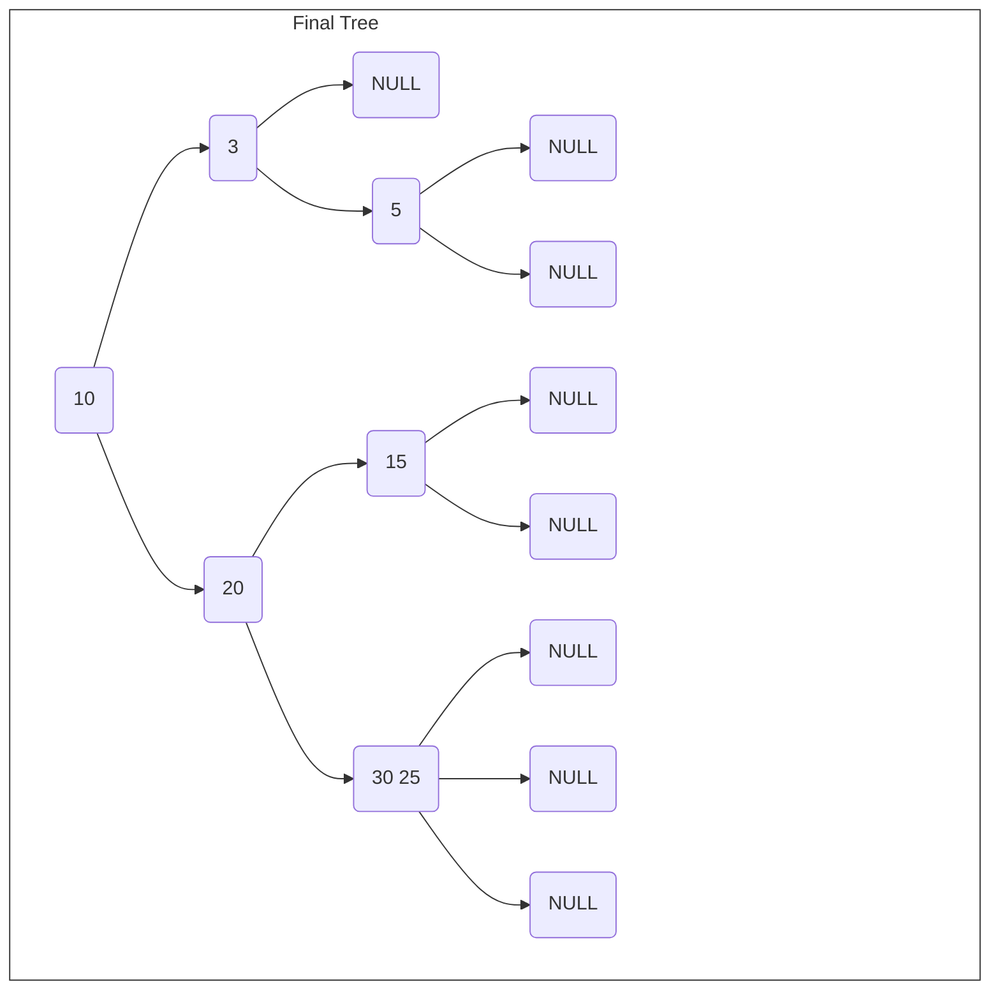

voltar para [Sumário](/Apostila/Sumário.md).

# 2. Árvore Red Black

Árvores Red Black são estruturas de árvores binárias de busca modificadas, para ficarem constantemente balanceadas, evitando o problema das árvores convencionais, que dependendo da ordem de inserção podem ficar com complexidade linear (O(n)) em vez de complexidade logarítmica (O(log n)), perdendo toda a razão de usar árvores e não outras estruturas. Cada nó da árvore tem uma cor, <b>vermelha ou preta</b>, e essas cores são usadas para aplicar as regras que garantem o balanceamento da árvore. Não admite chaves repetidas (tabela de símbolos).

## 2.1 Structs

^b7bf42

```C
typedef struct Node{
    int data;
    struct Node *right;
    struct Node *left;
    bool red;
}Node;

typedef struct Tree{
    Node *root;
}Tree;
```
## 2.2 Regras da RedBlack

^698f49

Os nós podem ser do tipo acima. Todo novo nó inserido é inserido com vermelho. E as seguintes regras têm de sempre ser seguidas:
<b>
1. Nenhum nó vermelho pode estar à direita do nó pai;
2. Não pode ter dois nós vermelhos à esquerda seguidos;
3. Um nó pai não pode ter os 2 filhos vermelhos.
 
</b>

---
- Assim que alguma das regras forem quebradas algum algoritmo deve ser chamado para resolver o problema: 
  1. Quando a regra <b>"1"</b> for quebrada deve ser aplicado um <b>rotateLeft()</b> para rotacionar o nó vermelho para à esquerda. 
  2. Quando a regra <b>"2"</b> for quebrada deve ser aplicado um <b>rotateRight()</b> para rotacionar o <b> elemento pai</b> para à direita, de forma que o elemento do meio se torne o novo pai.
  3. Quando a regra <b>"3"</b> for quebrada deve ser aplicado um <b>flipColors()</b> para trocar as cores dos nós filhos com o nó pai, pintando os nós filhos de <b>preto</b> e o nó pai de <b>vermelho</b>.

**Observação:**  A cor da raiz não importa .

---

### 2.2.1 Algoritmos de balanceamento

^b503dc

```C
    void flipColors(Node *root){
        h->left->red = !h->left->red;
        h->right->red = !h->right->red;
        h->red = !h->red;
    }

    Node *rotateLeft(Node *root)
    {
        Node *newroot = root->right;      //Novo no recebe a direita da raiz
        root->right = newroot->left;      //A direita da raiz recebe a arvore à esquerda da nova raiz
        newroot->left = root;             //A esquerda da nova raiz recebe a raiz antiga
        newroot->red = root->red;
        root->red = true;

        return newroot;
    }

    Node *rotateRight(Node *root)
    {
        Node *newroot = root->left;     //Novo no recebe a esquerda da raiz
        root->left = newroot->right;    //A esquerda da raiz recebe a arvore à direita da nova raiz
        newroot->right = root;          //A direita da nova raiz recebe a raiz antiga
        newroot->red = root->red;
        root->red = true;

        return newroot;
    }

```
### 2.2.2 Inserções em Árvore Red Black

^d4e3a3


- Exemplo de inserção em uma RedBlack com a seguinte sequência: 10, 15, 5, 3, 2, 20, 25, 30, 20.

```mermaid
graph TD;

    subgraph I1[Inserção do 10]
    A(10) --> B(NULL) & C(NULL)
    end

    subgraph I2[Inserção do 15]
    A2(10) --> B2(NULL) & C2(15)
    end

    subgraph I3[rotateLeft]
    A3(15) --> C3(10) & B3(NULL)
    end
    
    subgraph I4[Inserção do 5]
    A4(15)--> B4(10) --> C4(5)
    A4(15) --> D4(NULL)
    B4(10) --> E4(NULL)
    end

    subgraph I5[rotateRight]
    A5(10) --> B5(5) & C5(15)
    end

    subgraph I6[flipColors]
    A6(10) --> B6(5) & C6(15)
    end

    subgraph I7[Final Tree]
    a7(10) --> b7(3) & c7(20)
    b7(3) --> d7(2) & e7(5)
    c7(20) --> f7(15) & g7(30)
    g7(30) --> h7(25)
    end

    classDef myNodeStyle fill:#000000,stroke-width:1px, rx: 10px, ry 10px;

    class A,B,C,A2,B2,A3,B3,A4,D4,E4,A5,B6,C6,a7,b7,c7,d7,e7,f7,g7 myNodeStyle;

    style C2 fill: #FF272A, 
    style C3 fill: #FF272A
    style B4 fill: #FF272A
    style C4 fill: #FF272A
    style B5 fill: #FF272A
    style C5 fill: #FF272A
    style A6 fill: #FF272A
    style h7 fill: #FF272A
    style ... fill: 	
    style START fill:
    style END fill: 	

    style I1 fill: #FFFFFF00, stroke:#333, stroke-width: 1px;
    style I2 fill: #FFFFFF00, stroke:#333, stroke-width: 1px;
    style I3 fill: #FFFFFF00, stroke:#333, stroke-width: 1px;
    style I4 fill: #FFFFFF00, stroke:#333, stroke-width: 1px;
    style I5 fill: #FFFFFF00, stroke:#333, stroke-width: 1px;
    style I6 fill: #FFFFFF00, stroke:#333, stroke-width: 1px;
    style I7 fill: #FFFFFF00, stroke:#333, stroke-width: 1px;

    START --> I1
    I1 --> I2 --> I3 
    I4 --> I5 --> I6 --> ...
    END --> I7 
```




- No exemplo é possível visualizar todos os os casos em que alguma das regras é quebrada, e como é o comportamento das respectivas funções de "correção" da árvore, além do formato final da árvore após todas as inserções.

### 2.2.3 Algoritmos de Inserção

^abf4dd

```C
    bool isRed(Node *n)
    {
        if(n == NULL) 
            return false;
        if(n->red)
            return true;
        
        return false;    
    }

    Node *newnode(bool red, Node *left, Node *right, int data)
    {
        Node *nv = malloc(sizeof(Node));
        nv->red = red;
        nv->left = left
        nv->right = right;
        nv->data = data;

        return nv;
    }

    Node* insert(Node *root, int data)
    {
        if(root == NULL) 
            return newnode(true, NULL, NULL, data);

        //Inserção comum de uma BST
        if(less(data, root->data)){
            root->left = insert(root->left, data);
        }
        else if(less(root->data, data)){
            root->right = insert(root->right, data);
        }
        else{
            root->data = data
        }

        //Manipulações da Red Black
        //Regra 1
        if(!isRed(root->left) && isRed(root->right)) 
            root = rotateLeft(root);
        //Regra 2
        if(isRed(root->left) && isRed(root->left->left)) 
            root = rotateRight(root);
        //Regra 3
        if(isRed(root->left) && isRed(root->right))         
            flipColors(root)
    }
```

## 2.3 Alturas de uma Red Black

^391783

Em suma existem dois tipos de altura associadas à uma árvore red black, que são a **Altura total** e a **Altura Negra**.

### 2.3.1 Altura Total

^2e3b70

A altura total refere-se à distância de qualquer nó folha até a raiz da árvore.

#### Funções:
```C
    int alturaTotal(Tree *root)
    {
        int count = 0;
        while(root != NULL)
        {
            count++;
            root = root->left;
        }
        return count;
    }
```
```C
    int alturaTotal(Tree *root, int h)
    {
        if(root == NULL)
            return h;

        int esq = alturaTotal(root->left, h + 1);
        int dir = alturaTotal(root->right, h + 1);

        if(esq > dir)
            return esq;

        return dir;
    }

```

### 2.3.2 Altura Negra

^599d25

Altura Negra refere-se à distância de um nó folha **preto** até a raiz.

#### Função:
```C
    int alturaNegra(Tree *root, int h)
    {
        if (root == NULL) 
            return h;

        int esq = alturaNegra(root->left, h + 1);
        int dir = alturaNegra(root->right, h + 1);

        if(root->red == false && esq > dir)
            return esq; 
        else if(root->red == false && dir > esq)
            return dir;
    }
```

## 2.4 Bônus - Árvore 2-3

^537ada

Árvores 2-3 são estruturas similares a as árvores red black. Também são constantemente balanceadas (altura = log n). Contém nós de 3 tipos, sendo um deles do tipo **"fantasma"**.

1. Tipo 2: dois filhos (contém apenas 1 elemento);
2. Tipo 3: três filhos (contém 2 elementos);
3. Tipo 4: quatro filhos (contém 3 elementos. **Temporário**, sempre que surge um nó deste tipo ele é quebrado e o elemento do meio se torna a nova raiz e agrupa os outros dois elementos a esquerda(menor) e a direita(maior)).

- A árvore final do [diagrama](#222-inserções-em-árvore-red-black), poderia ser representada da seguinte forma em um modelo de árvore 2-3:


