# Estrutura de Dados e Algoritmos 2

Este repositório é dedicado a disciplina de 'Estrutura de dados e algoritmos 2' da Universidade de Brasília. Tem como objetivo documentar as [Listas de Exercícios](#listas-de-exercícios) disponibilizadas no [CD-MOJ](https://moj.naquadah.com.br/cgi-bin/index.sh). Bem como a [Apostila](#apostila) dos conteúdos desenvolvidos durante o semestre. 

Professor: [Bruno Ribas.](https://www.brunoribas.com.br/)


# Listas de Exercícios

<b>Esta seção contém as listas de exercícios desenvolvidos na disciplina, para acessar os problemas basta clicar no link relacionado ao nome do exercíco em questão. E para acessar as soluções clique no título da lista desejada.</b>

## [Lista I - Desenferrujando para semestre](listas/lista1-desenferrujando)  

<b>A primeira lista é voltada para revisão e familiarização com o formato das listas.</b>

- A : [Olá Mundo](https://moj.naquadah.com.br/contests/bcr-EDA2-2023_2-lista1-relembrando/olamundo.pdf)
- B : [Soma2](https://moj.naquadah.com.br/contests/bcr-EDA2-2023_2-lista1-relembrando/soma2.pdf)
- C : [SomaN](https://moj.naquadah.com.br/contests/bcr-EDA2-2023_2-lista1-relembrando/soma.pdf)
- D : [EOF](https://moj.naquadah.com.br/contests/bcr-EDA2-2023_2-lista1-relembrando/eof.pdf)
- E : [Viagem Aconselha](https://moj.naquadah.com.br/contests/bcr-EDA2-2023_2-lista1-relembrando/viagemaconselha.pdf)
- F : [Desfazer No Editor/cntrl z](https://moj.naquadah.com.br/contests/bcr-EDA2-2023_2-lista1-relembrando/ctrl-z.pdf)
- G : [Cofrinhos da vó Vitória](https://br.spoj.com/problems/COFRE.pdf)
- H : [Ultrapassa Minimamente](https://moj.naquadah.com.br/contests/bcr-EDA2-2023_2-lista1-relembrando/ultrapassaminimamente.pdf)
- I : [Soma String](https://moj.naquadah.com.br/contests/bcr-EDA2-2023_2-lista1-relembrando/soma_string.pdf)
- J : [Quem vai ser Reprovado](https://br.spoj.com/problems/PLACAR.pdf)
- K : [Frequência na aula](https://br.spoj.com/problems/FREQUE12.pdf) 
- L : [Analisando dados de degustação](https://moj.naquadah.com.br/contests/bcr-EDA2-2023_2-lista1-relembrando/sequencia-desgustacao.pdf)
- M : [Número Proibido](https://moj.naquadah.com.br/contests/bcr-EDA2-2023_2-lista1-relembrando/proibido.pdf)
- N : [Notas da Turma](https://moj.naquadah.com.br/contests/bcr-EDA2-2023_2-lista1-relembrando/divide-turma.pdf)
- O : [Mescla Listas](https://moj.naquadah.com.br/contests/bcr-EDA2-2023_2-lista1-relembrando/le-junta.pdf)
---

## [Lista II - hashing](listas/lista2-hashing/)
<b>A segunda lista tinha o objetivo de resolver exercícios relacionados à [Hash Table](#1-hash-table).</b>

- A : [Desfile dos Patos](https://moj.naquadah.com.br/contests/bcr-EDA2-2023_2-hash/desfile.pdf)
- B : [Diga-me a frequência](https://moj.naquadah.com.br/contests/bcr-EDA2-2023_2-hash/digafrequencia.pdf)
- C : [Eleição U.R.S.A.L](https://moj.naquadah.com.br/contests/bcr-EDA2-2023_2-hash/eleicao-ursal-big.pdf)
- D : [Notas Curiosas](https://moj.naquadah.com.br/contests/bcr-EDA2-2023_2-hash/notas.pdf)
- E : [Notas](https://br.spoj.com/problems/NOTAS14.pdf)
- F : [HashIT!](https://www.spoj.com/problems/HASHIT.pdf)
- G : [Hash](https://br.spoj.com/problems/HASHADIQ.pdf) 
- H : [Mensagens Nlogoniences](https://moj.naquadah.com.br/contests/bcr-EDA2-2023_2-hash/mensagens.pdf)
---

## [Listas III - Priority Queue](listas/lista3-priorityQueue/)
<b>A terceira lista contém exercícios de [Fila de Prioridades/Heap](#heap).</b>

- A : [Menores Placas](https://moj.naquadah.com.br/contests/bcr-EDA2-2023_2-pq/menores-placas.pdf)
- B : [Churrascarias da Avenida](https://br.spoj.com/problems/CHURRASC.pdf)
- C : [Minimun Stocks](https://www.spoj.com/problems/MINSTOCK.pdf)
---

## [Lista IV - QuickSelect](listas/lista4-quickSelect/)
<b>A quarta lista tem como enfoque o algoritmo [QuickSelect](#quickselect), um algoritmo de busca baseado no algoritmo de ordenação QuickSort.</b>

- A : [Classificados de Sementes](https://moj.naquadah.com.br/contests/bcr-EDA2-2023_2-quickselect/classificado-agronomia.pdf)
- B : [kk-página](https://moj.naquadah.com.br/contests/bcr-EDA2-2023_2-quickselect/kk-pagina.pdf)
- C : [Desfile dos Patos - QuickSelect](https://moj.naquadah.com.br/contests/bcr-EDA2-2023_2-quickselect/desfile.pdf)
- D : [Menores Placas - QuickSelect](https://moj.naquadah.com.br/contests/bcr-EDA2-2023_2-quickselect/menores-placas.pdf)

---

## [Lista V - Grafos, o início](listas/lista5-grafos/)
**A quinta lista introduz os conceitos e algoritmos básicos de [grafos](#4-grafos)**

- A : [Eu vou estar lá!](https://moj.naquadah.com.br/contests/bcr-EDA2-2023_2-grafos/euvouestarla.pdf)
- B : [Estradas asfaltadas](https://moj.naquadah.com.br/contests/bcr-EDA2-2023_2-grafos/grafo-nucleos-cidades.pdf)
- C : [Estradas asfaltadas - viagem aérea](https://moj.naquadah.com.br/contests/bcr-EDA2-2023_2-grafos/grafo-ajude-joao.pdf)
- D : [Natureza](https://br.spoj.com/problems/NATUREZA.pdf)
- E : [Ir e vir](https://br.spoj.com/problems/IREVIR.pdf)

---

# Apostila

## Sumário


# 1. Hash Table
É uma estrutura do tipo chave-valor, onde as chaves são usadas como índice para achar o elemento desejado, não admite chaves repetidas (tabela de símbolos). A chave é passada por uma função (normalmente o módulo) onde é gerado o índice/endereço na tabela. Esta função tem caráter determinístico ou seja, uma mesma chave sempre gera um mesmo endereço. Dessa forma é possível acessar qualquer elemento da tabela em grandeza constante O(1).

- Função de hashing:
---
```C
int hash(int k, int m){
    return k % m;
}
```
---

## 1.1 Colisões

As colisões são um problema comum das tabelas hash, ocorrem quando duas chaves diferentes resultam no mesmo endereço. Existem várias técnicas para resolver colisões.

### 1.1.1 Endereçamento aberto
---
A estratégia do Endereçamento aberto, consiste basicamente em: se houver colisão, aloque o elemento 1 endereço pro lado. Porém, caso o número de colisões seja muito grande a busca passa a ser <b>linear (O(n))</b>, e não mais <b>constante (O(1))</b>.  

Por isso é interessante definir um número máximo de colisões para a hash, 10 por exemplo. Assim o tempo continuaria sendo <b>constante (O(10))</b>. Mas, caso o limite de colisões esteja sendo muito excedido, há a chance de ter de crescer a tabela, que custa O(n).

### 1.1.2 Double Hash
---
A estratégia consiste em: quando ocorrer uma colisão, aplicar uma nova  função hash ao elemento desta forma, os elementos colididos ficariam mais espaçados entre si, diferente da estratégia anterior. Também é interessante manter um limite de colisões, para não preencher a tabela de forma rápida.

- Exemplo:
---
```C
#define HASH(K, M) (K % M)
#define DOUBLE_HASH(K, M) (K % 2M)
```
---
Onde 'K' é a chave e 'M' é o tamanho da hash table.

### 1.1.3 Encadeamento separado
---
Cada posição da hash table seria a cabeça de uma lista encadeada. Ou seja, sempre que ocorresse uma colisão, o elemento simplesmente seria adicionado ao início da lista encadeada. Diferente das outras, nessa estratégia é mais difícil que o número de colisões fique muito grande, já que elementos colididos não ocupam a posição de outros elementos, tal que, mesmo que em uma chave específica o acesso seja linear, em outros endereços ele continuaria a ser constante. Logo, vale avaliar cada caso e verificar se um limite de colisões se torna necessário ou não.

## 1.2 Bônus - Discussão sobre complexidades

|                                  | Inserção | Remoção  | Busca    | Crescer  |
| -------------------------------- | -------- | -------- | -------- | -------- |
| **Vetor não ordenado**           | O(1)     | O(1)     | O(n)     | O(n)     |
| **Vetor Ordenado**               | O(n)     | O(n)     | O(log n) | O(n)     |
| **Lista encadeada não ordenada** | O(1)     | O(n)     | O(n)     | Dinâmico |
| **Lista encadeada ordenada**     | O(n)     | O(n)     | O(n)     | Dinâmico |
| **Hash Table**                   | O(1)     | O(1)     | O(1)     | O(n)     |
| **Árvores binárias**             | O(log n) | O(log n) | O(log n) | Dinâmico |

---
# 2. Árvore Red Black

Árvores Red Black são estruturas de árvores binárias de busca modificadas, para ficarem constantemente balanceadas, evitando o problema das árvores convencionais, que dependendo da ordem de inserção podem ficar com complexidade linear (O(n)) em vez de complexidade logarítmica (O(log n)), perdendo toda a razão de usar árvores e não outras estruturas. Cada nó da árvore tem uma cor, <b>vermelha ou preta</b>, e essas cores são usadas para aplicar as regras que garantem o balanceamento da árvore. Não admite chaves repetidas (tabela de símbolos).

## 2.1 Structs

```C
typedef struct Node{
    int data;
    struct Node *right;
    struct Node *left;
    bool red;
}Node;

typedef struct Tree{
    Node *root;
}Tree;
```
## 2.2 Regras da RedBlack

Os nós podem ser do tipo acima. Todo novo nó inserido é inserido com vermelho. E as seguintes regras têm de sempre ser seguidas:
<b>
1. Nenhum nó vermelho pode estar à direita do nó pai;
2. Não pode ter dois nós vermelhos à esquerda seguidos;
3. Um nó pai não pode ter os 2 filhos vermelhos.
 
</b>

---
- Assim que alguma das regras forem quebradas algum algoritmo deve ser chamado para resolver o problema: 
  1. Quando a regra <b>"1"</b> for quebrada deve ser aplicado um <b>rotateLeft()</b> para rotacionar o nó vermelho para à esquerda. 
  2. Quando a regra <b>"2"</b> for quebrada deve ser aplicado um <b>rotateRight()</b> para rotacionar o <b> elemento pai</b> para à direita, de forma que o elemento do meio se torne o novo pai.
  3. Quando a regra <b>"3"</b> for quebrada deve ser aplicado um <b>flipColors()</b> para trocar as cores dos nós filhos com o nó pai, pintando os nós filhos de <b>preto</b> e o nó pai de <b>vermelho</b>.

**Observação:**  A cor da raiz não importa .

---

### 2.2.1 Algoritmos de balanceamento

```C
    void flipColors(Node *root){
        h->left->red = !h->left->red;
        h->right->red = !h->right->red;
        h->red = !h->red;
    }

    Node *rotateLeft(Node *root)
    {
        Node *newroot = root->right;      //Novo no recebe a direita da raiz
        root->right = newroot->left;      //A direita da raiz recebe a arvore à esquerda da nova raiz
        newroot->left = root;             //A esquerda da nova raiz recebe a raiz antiga
        newroot->red = root->red;
        root->red = true;

        return newroot;
    }

    Node *rotateRight(Node *root)
    {
        Node *newroot = root->left;     //Novo no recebe a esquerda da raiz
        root->left = newroot->right;    //A esquerda da raiz recebe a arvore à direita da nova raiz
        newroot->right = root;          //A direita da nova raiz recebe a raiz antiga
        newroot->red = root->red;
        root->red = true;

        return newroot;
    }

```
### 2.2.2 Inserções em Árvore Red Black


- Exemplo de inserção em uma RedBlack com a seguinte sequência: 10, 15, 5, 3, 2, 20, 25, 30, 20.


```mermaid
graph TD;

    subgraph I1[Inserção do 10]
    A(10) --> B(NULL) & C(NULL)
    end

    subgraph I2[Inserção do 15]
    A2(10) --> B2(NULL) & C2(15)
    end

    subgraph I3[rotateLeft]
    A3(15) --> C3(10) & B3(NULL)
    end
    
    subgraph I4[Inserção do 5]
    A4(15)--> B4(10) --> C4(5)
    A4(15) --> D4(NULL)
    B4(10) --> E4(NULL)
    end

    subgraph I5[rotateRight]
    A5(10) --> B5(5) & C5(15)
    end

    subgraph I6[flipColors]
    A6(10) --> B6(5) & C6(15)
    end

    subgraph I7[Final Tree]
    a7(10) --> b7(3) & c7(20)
    b7(3) --> d7(2) & e7(5)
    c7(20) --> f7(15) & g7(30)
    g7(30) --> h7(25)
    end

    classDef myNodeStyle fill:#000000,stroke-width:1px, rx: 10px, ry 10px;

    class A,B,C,A2,B2,A3,B3,A4,D4,E4,A5,B6,C6,a7,b7,c7,d7,e7,f7,g7 myNodeStyle;

    style C2 fill: #FF272A, 
    style C3 fill: #FF272A
    style B4 fill: #FF272A
    style C4 fill: #FF272A
    style B5 fill: #FF272A
    style C5 fill: #FF272A
    style A6 fill: #FF272A
    style h7 fill: #FF272A
    style ... fill: 	
    style START fill:
    style END fill: 	

    style I1 fill: #FFFFFF00, stroke:#333, stroke-width: 1px;
    style I2 fill: #FFFFFF00, stroke:#333, stroke-width: 1px;
    style I3 fill: #FFFFFF00, stroke:#333, stroke-width: 1px;
    style I4 fill: #FFFFFF00, stroke:#333, stroke-width: 1px;
    style I5 fill: #FFFFFF00, stroke:#333, stroke-width: 1px;
    style I6 fill: #FFFFFF00, stroke:#333, stroke-width: 1px;
    style I7 fill: #FFFFFF00, stroke:#333, stroke-width: 1px;

    START --> I1
    I1 --> I2 --> I3 
    I4 --> I5 --> I6 --> ...
    END --> I7 
```

- No exemplo é possível visualizar todos os os casos em que alguma das regras é quebrada, e como é o comportamento das respectivas funções de "correção" da árvore, além do formato final da árvore após todas as inserções.

### 2.2.3 Algoritmos de Inserção

```C
    bool isRed(Node *n)
    {
        if(n == NULL) 
            return false;
        if(n->red)
            return true;
        
        return false;    
    }

    Node *newnode(bool red, Node *left, Node *right, int data)
    {
        Node *nv = malloc(sizeof(Node));
        nv->red = red;
        nv->left = left
        nv->right = right;
        nv->data = data;

        return nv;
    }

    Node* insert(Node *root, int data)
    {
        if(root == NULL) 
            return newnode(true, NULL, NULL, data);

        //Inserção comum de uma BST
        if(less(data, root->data)){
            root->left = insert(root->left, data);
        }
        else if(less(root->data, data)){
            root->right = insert(root->right, data);
        }
        else{
            root->data = data
        }

        //Manipulações da Red Black
        //Regra 1
        if(!isRed(root->left) && isRed(root->right)) 
            root = rotateLeft(root);
        //Regra 2
        if(isRed(root->left) && isRed(root->left->left)) 
            root = rotateRight(root);
        //Regra 3
        if(isRed(root->left) && isRed(root->right))         
            flipColors(root)
    }
```

## 2.3 Alturas de uma Red Black
Em suma existem dois tipos de altura associadas à uma árvore red black, que são a **Altura total** e a **Altura Negra**.

### 2.3.1 Altura Total
A altura total refere-se à distância de qualquer nó folha até a raiz da árvore.

#### Funções:
```C
    int alturaTotal(Tree *root)
    {
        int count = 0;
        while(root != NULL)
        {
            count++;
            root = root->left;
        }
        return count;
    }
```
```C
    int alturaTotal(Tree *root, int h)
    {
        if(root == NULL)
            return h;

        int esq = alturaTotal(root->left, h + 1);
        int dir = alturaTotal(root->right, h + 1);

        if(esq > dir)
            return esq;

        return dir;
    }

```

### 2.3.2 Altura Negra
Altura Negra refere-se à distância de um nó folha **preto** até a raiz.

#### Função:
```C
    int alturaNegra(Tree *root, int h)
    {
        if (root == NULL) 
            return h;

        int esq = alturaNegra(root->left, h + 1);
        int dir = alturaNegra(root->right, h + 1);

        if(root->red == false && esq > dir)
            return esq; 
        else if(root->red == false && dir > esq)
            return dir;
    }
```

## 2.4 Bônus - Árvore 2-3
Árvores 2-3 são estruturas similares a as árvores red black. Também são constantemente balanceadas (altura = log n). Contém nós de 3 tipos, sendo um deles do tipo **"fantasma"**.

1. Tipo 2: dois filhos (contém apenas 1 elemento);
2. Tipo 3: três filhos (contém 2 elementos);
3. Tipo 4: quatro filhos (contém 3 elementos. **Temporário**, sempre que surge um nó deste tipo ele é quebrado e o elemento do meio se torna a nova raiz e agrupa os outros dois elementos a esquerda(menor) e a direita(maior)).

- A árvore final do [diagrama](#222-inserções-em-árvore-red-black), poderia ser representada da seguinte forma em um modelo de árvore 2-3:

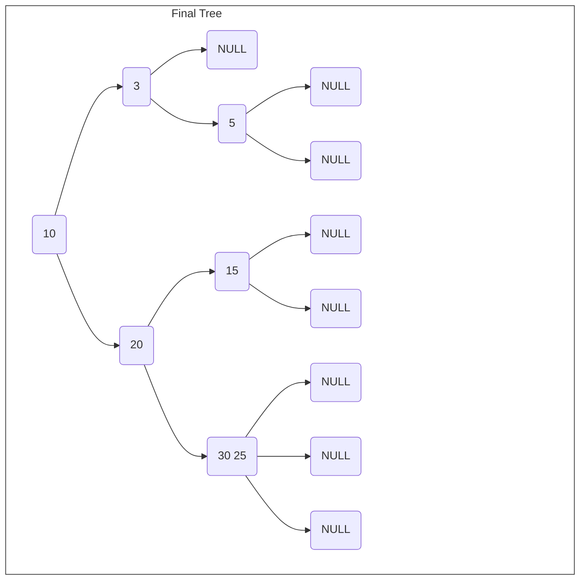

# 3. Fila de Prioridades
A Fila de Prioridades ou Heap, é uma estrutura que organiza os elementos com base em um valor que é definido como prioridade. Dispondo os elementos tal que, o de maior prioridade sempre estará no topo da fila, admite chaves reptidas, ou seja, com a **mesma prioridade**. Ela é representada como uma árvore binária em vetor, no qual **o índice zero fica inutilizado**, e os **filhos de um elemento k**, são, respectivamente, **2k e 2k + 1**, Reciprocamente o pai de qualquer elemento **k** é **k/2**.

- Exemplo:
>Legenda: Branco: Pai (k), Vermelho: filho (2k), Roxo: filho (2k + 1).

```mermaid  
    graph LR;
    A[0] --> B[1]
    B --> C[2]
    C --> D[3]
    D --> E[4]
    E --> F[5]
    F --> G[6]
    G --> H[7]

    style B stroke-width:3px, stroke: #FFFFFF
    style C stroke-width:3px, stroke: #FF0000 
    style D stroke-width:3px, stroke: #7F00FF
    

    classDef myNodeStyle fill:#000000;
    class C,B,D,E,F,G,H myNodeStyle; 
```

```mermaid
    graph LR;
    A[0] --> B[1]
    B --> C[2]
    C --> D[3]
    D --> E[4]
    E --> F[5]
    F --> G[6]
    G --> H[7]


    style C stroke-width:3px, stroke: #FFFFFF
    style E stroke-width:3px, stroke: #FF0000 
    style F stroke-width:3px, stroke: #7F00FF
    

    classDef myNodeStyle fill:#000000;
    class C,B,D,E,F,G,H myNodeStyle;
```

```mermaid
    graph LR;
    A[0] --> B[1]
    B --> C[2]
    C --> D[3]
    D --> E[4]
    E --> F[5]
    F --> G[6]
    G --> H[7]


    style D stroke-width:3px, stroke: #FFFFFF
    style G stroke-width:3px, stroke: #FF0000 
    style H stroke-width:3px, stroke: #7F00FF
    

    classDef myNodeStyle fill:#000000;
    class C,B,D,E,F,G,H myNodeStyle;
```

E assim sucessivamente.

## 3.1 Conceitos

### 3.1.1 Fila de prioridades crescente e decrescente
Na **heap crescente** o elemento de **menor prioridade** está no topo da fila, conforme se move para baixo a prioridade dos elementos aumentam. Na **heap decrescente** o elemento de **maior prioridade** está no topo da fila, conforme se move para baixo a prioridade dos elementos diminuem.

### 3.1.2 Item máximo e item mínimo
Um item **K** é máximo se nenhum item é estritamente **maior** que **K**. Um item **K** é mínimo se nenhum item é estritamente **menor** que **K**. Podem existir mais de um item máximo e mais de um item mínimo.

### 3.1.3 Complexidades

|                    | Inserção | Remoção  | Consulta |
| ------------------ | -------- | -------- | -------- |
| **Priority Queue** | O(log n) | O(log n) | O(1)     |


## 3.2 Algoritmos

### 3.2.1 Struct e macros

```C
    #define less(a,b) (a < b)
    #define greater(a,b) (a > b)
    #define swap(a,b)   \
        {               \
            Item temp = a; \
            a = b;      \
            b = temp;   \
        }

    typedef struct Heap
    {
        Item *data;
        int size;
    }Heap;
```
>Obs: "Item" pode ser de qualquer tipo: int, char, tipos abstratos, etc... 

### 3.2.2 Conserta pra cima (swim)
Suponha que em algum momento estejamos com a seguinte Heap crescente "estragada":

> Obs: quanto mais próximo do fim do alfabeto, maior a prioridade


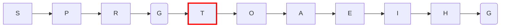

- Observe que " T " está em uma posição errada, já que é o elemento de maior prioridade, então temos que consertar sua posição.


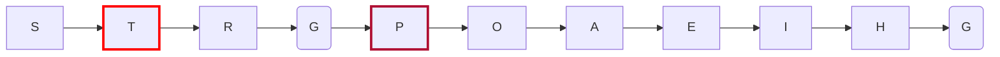

- O " T " assume a posição de " P ".

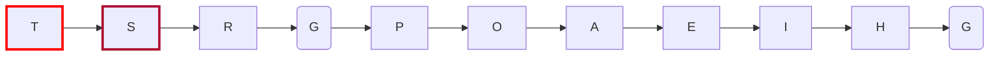

- E, por fim, o " T " assume sua posição correta. O algoritmo que foi aplicado para resolver a incongruência, pode ser chamado de **"Conserta para cima"** ou **"swim"**.

Função "Conserta pra cima" ou **fixup**:

```C
    void fixup(Item *hp, int k)
    {
        //less() ou greater() depende da implementação
        for(int i = k; i > 1 && less(hp[i/2], hp[i]); i/=2) 
            swap(hp[i], hp[i/2]);
    }

    void fixup2(Item *hp, int k)
    {
        //less() ou greater() depende da implementação
        while(k > 1 && less(v[k/2], v[k]))
        {
            swap(v[k], v[k/2]);
            k /= 2;
        }
    }
```

### 3.2.3 Conserta pra baixo (sink)

Suponha que em algum momento estejamos com a seguinte Heap decrescente "estragada":

> Obs: quanto mais próximo do fim do alfabeto, maior a prioridade


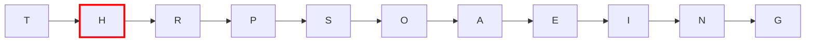

- Observe que " H " está em uma posição errada, está em uma posição acima de " P " e " S ", mesmo tendo menor prioridade.

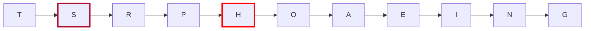

- " H " troca com " S " ("S" já está na posição correta pois tem maior prioridade que qualquer elemento abaixo dele).

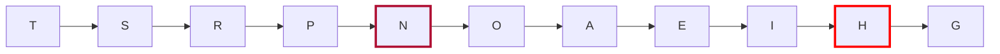

- " H " troca com " N " ("N" já está na posição correta pois tem maior prioridade que qualquer elemento abaixo dele).

Função "Conserta pra baixo" ou **fixdown**:
```C
    void fixdown(Item *hp, int k, int size)
    {
        int j;
        while(2*k <= size)
        {
            j = 2*k;                            //j = filho 2k
            if(j < size && less(v[j], v[j+1]))  //verfica qual filho é menor
                j++;                            //muda para filho (2k + 1), se for menor
            if(!less(v[k], v[j]))               //se o filho(j) tem menor prioridade que o pai(k), quebra o laço
                break;
            swap(v[k], v[j]);                   // troca pai e filho
            k = j;                              //pai assume posição do filho
        }
    }
```


### 3.2.4 Inserção, remoção e consulta

```C
    Heap PQinit(int n)
    {
        Heap hp;
        hp.size = 0;
        hp.data = malloc(sizeof(Item) * (k + 1));
        
        return hp;
    }

    void PQinsert(Heap *hp, Item c)
    {
        hp->data[++hp->size] = c;
        fixup(hp->heap, hp->size);
    }

    Item PQespia(Heap hp)
    {
        return hp.data[1];
    }

    Item PQremove(Heap *hp, int i)
    {
        Item t = hp->data[i];
        hp->data[i] = hp->data[hp->size--];
        fixdown(hp->data, hp->size, i);

        return t;
    }
```

# 4. Grafos
Grafos são estruturas de dados amplamente utilizadas na computação. São uma ótima maneira de representar relacionamentos entre elementos, como por exemplo: mapas, redes, encanação, aeroportos, etc. Podem ser representados graficamente como um conjunto de vértices e arestas.

## 4.1 Implementação
Existem duas principais formas de reprensentá-los. **Matriz de adjacência** ou **Lista de adjacência**.

### 4.1.1 Matriz de Adjacência
Uma matriz bidimensional que representa a relação entre os vértices. Os elementos da matriz indicam se há ou não uma relação entre os vértices. Útil para grafos densos (completos ou quase completos). Consome espaço proporcional à V² (onde V é o número de vértices). Acesso rápido para verificar a existência de arestas (O(1)).

- Imagine o seguinte grafo:

```mermaid
    graph LR;
    0 --- 1 & 2
    1 --- 2
    2 --- 3
    4

    classDef myNodeStyle fill:#000000, stroke-width: 1px, rx: 10px, ry: 10px;
    class 0,1,2,3,4 myNodeStyle;
```

- Sua respectiva matriz de adjacência poderia ser representada da seguinte maneira:
  
|   | 0 | 1 | 2 | 3 | 4 |
|---|---|---|---|---|---|
| **0** | 1 | 1 | 1 | 0 | 0 |
| **1** | 1 | 1 | 1 | 0 | 0 |
| **2** | 1 | 1 | 1 | 1 | 0 |
| **3** | 0 | 0 | 1 | 1 | 0 |
| **4** | 0 | 0 | 0 | 0 | 1 |

  

- **Os ' 1 's representam as conexões** e os **' 0 's a ausência delas**, por padrão a diagonal principal já é preenchida com ' 1 ', a conexão de um elemento com ele mesmo é trivial.

Veja a [Implementação.](#45-structs-e-algoritmos-inicias)

### 4.1.2 Lista de Adjacência
A ideia da lista de adjacência é construir um vetor de tamanho V (número de vértices) onde cada índice representa um vértice do grafo, e cada espaço do vetor contém um ponteiro para uma lista encadeada, que representa as conexões daquele vértice com outros vértices do grafo. Pode ser comparada ao [Encadeamento Separado](#113-encadeamento-separado) da Hash Table.

| 0   | 1   | 2   | 3   | 4   |
| --- | --- | --- | --- | --- |
| 1   | 2   | 3   |
| 2   |


Note que é uma representação bem mais enxuta comparada à matriz, logo também ocupa menos espaço. Vale ressaltar que, uma conexão não precisa ser representada duas vezes, ou seja, se um vértice tem conexão com um vértice menor que ele mesmo, não é necessário incluir esta aresta na lista de adjacências, pois esta aresta já estará representada no vértice menor, por exemplo a **aresta (0, 2)**, note que o **0** já contém a conexão com o **2**, portanto não se faz necessário representar esta conexão novamente no vértice **2**. Obviamente isto só é verdadeiro para [grafos não direcionados](#42-grafos-dirigidos-ou-digrafos), neste caso, aí sim, eu teria que inserir esta conexão em ambos vértices.

Veja a [Implementação.](#45-structs-e-algoritmos-inicias)

### 4.1.3 Bônus - Matriz X Lista
Apresentadas ambas estratégias, podemos definir algumas vantagens e desvantagens entre elas:
> E = número de arestas , V = número de vértices

|                        | Vetor de Arestas | Matriz de Adjacência | Lista de Adjacência |
| ---------------------- | ---------------- | -------------------- | ------------------- |
| **space**              | E                | V²                   | V + E               |
| **initialize**         | 1                | V²                   | V                   |
| **copy**               | E                | V²                   | E                   |
| **destroy**            | 1                | V                    | E                   |
| **insert Edge**        | 1                | 1                    | 1                   |
| **find/remove Edge**   | E                | 1                    | V                   |
| **Vertex is isolate?** | E                | V                    | 1                   |
| **Path from U to V**   | E * log V        | V²                   | E + V               |


## 4.2 Grafos dirigidos ou Digrafos
São grafos nos quais as arestas possuem direção, ou seja, se tenho uma aresta de '0' para '1', não necessariamente tenho uma aresta de '1' para '0'.

```mermaid
    graph LR;
    4 --> 0 & 1
    0 --> 1
    1 --> 2
    2 --> 0 & 3
    0 --> 3


    classDef myNodeStyle fill:#000000, stroke-width: 1px, rx: 10px, ry: 10px;
    class 0,1,2,3,4 myNodeStyle;
```

- Há um fluxo entre os vértices, a partir do "0" consigo alcançar qualquer vértice, porém a partir do "3" não consigo atingir nenhum outro vértice.


## 4.3 Grafo Completo
Todos os vértices são ligados entre si, ou seja, todo vértice tem uma aresta para cada outro vértice no grafo. Totalizando o de máximo v*(v-1)/2 arestas, onde 'v' é o número de vértices.


```mermaid
    graph LR;
    0 --- 1 & 2 & 3
    2 --- 3
    1 --- 2 & 3


    classDef myNodeStyle fill:#000000, stroke-width: 1px, rx: 10px, ry: 10px;
    class 0,1,2,3,4 myNodeStyle;
```

- Note que todos os vértices tem ligação entre si, tornando o grafo acima completo. Com um **total de 4 vértices**, têm-se um **total de 4*3/2** arestas, ou **6 arestas**.


## 4.4 Conceitos

### 4.4.1 Classificação de Vértices
---
- Vértices **"sink"** são aquelas que não possuem arestas **saindo** dele, apenas **chegando**, **3** é um vértice sink.
- Vértices **"source"** são aqueles que não possuem arestas **chegando** dele, apenas **saindo**, **4** é um vértice source.

### 4.4.2 Caminho 
---
Caminho em grafos é a **sequência de vértices** em que cada vértice **sucessivo** é **adjacente** ao predecessor, ou seja, cada vértice está conectado ao seguinte por uma aresta. São uma parte essencial da análise e resolução de problemas com grafos e podem ter diversas aplicações, incluindo navegação, otimização, planejamento de rotas, etc.

- **Caminho Simples** - Um caminho onde todos os vértices são distintos, exceto o primeiro e último, que podem ser iguais. *Obs: Não necessariamente o caminho mais curto*.

- **Caminho fechado (Circuito)** - Um caminho no qual o vértice de partida e vértice de chegada é o mesmo. Se for um **caminho simples**, todos os vértices no caminho são distintos, é chamado de **Ciclo**.

Exemplo:
  ```mermaid
    graph LR;
    0 --- 1
    1 --- 2
    2 --- 0

    classDef myNodeStyle fill:#000000, stroke-width: 1px, rx: 10px, ry: 10px;
    class 0,1,2,3,4 myNodeStyle;
  ```

- **Caminho mínimo** -   O caminho mínimo entre dois vértices é o caminho mais curto em termos de custo, peso ou distância. Isso é frequentemente usado em problemas de otimização, como encontrar a rota mais curta em um sistema de transporte.

### 4.4.3 Conectividade
---
- **Grafo Conexo** - Um grafo é conexo se há um caminho de cada vértice para todo outro vértice. Em outras palavras não importa o vértice de partida você sempre será capaz de alcançar qualquer outro vértice do grafo. 

Exemplo:
```mermaid
    graph LR;
    0 --- 1
    1 --- 2
    2 --- 0

    classDef myNodeStyle fill:#000000, stroke-width: 1px, rx: 10px, ry: 10px;
    class 0,1,2,3,4 myNodeStyle;
```

---
- **Grafo não Conexo** - Um grafo que não é conexo consiste em um conjunto de outros componentes conexos.

Exemplo:
```mermaid
    graph LR;
    0 --- 1
    1 --- 2
    2 --- 0
    4 --- 5

    classDef myNodeStyle fill:#000000, stroke-width: 1px, rx: 10px, ry: 10px;
    class 0,1,2,3,4,5 myNodeStyle;
```

### 4.4.4 Grafos dirigidos conexos acíclicos
---
- É um grafo dirigido que não possui ciclos. **Árvores são grafos dirigidos acíclicos**, observe que **Toda árvore é um digrafo acíclico**, porém **nem todo digrafo acíclico é uma árvore**, vértices de um digrafo podem ter mais de uma aresta e não necessariamente existe uma hierarquia entre os filhos e o pai, diferentemente de uma árvore.

```mermaid

    graph TD;
    0 --> 1 & 2;
    1 --> 5 & 3 & 4;
    2 --> 6 & 7;
    3 --> 8 & 9 & 10;
    4 --> 11;
    7 --> 12 & 13;

    classDef myNodeStyle fill:#000000, stroke-width: 1px, rx: 10px, ry: 10px;
    class 0,1,2,3,4,5,6,7,8,9,10,11,12,13 myNodeStyle;
```

### 4.4.5 Grafo dirigido fortemente conexo
---
A noção de **conectividade forte** é aplicada aos **digrafos**. Um grafo direcionado ou dirigido é considerado fortemente conexo se para cada par de vértices (v, w) existe uma aresta de **v para w** e uma aresta de **w para v**.

## 4.5 Structs e algoritmos inicias
A estrutura básica para representar um grafo é a **Aresta(Edge)**, que simboliza a conexão entre dois **Vértices(Vertex)**, que podem ser abstraídos para um **Item** em questão, que pode ser um `int`, `char` ou qualquer `tipo abstrato` que for definido.
```C
    typedef struct Edge{
        int v; 
        int w;
    }Edge;  
```
Outras estruturas fundamentais são as de [Matriz de Adjacência](#411-matriz-de-adjacência) e [Lista de Adjacência](#412-lista-de-adjacência), que são:
```C
    #define MAX_VERTEX 100 

    //Matriz de Adjacência
    typedef struct Graph{
        int numVertex;                          //Guarda o número total de vértices
        int size;                               //Número total de arestas
        int adj[MAX_VERTEX][MAX_VERTEX];        //Matriz de fato
    }Graph;

    //Lista de Adjacência
    typedef struct Node{
        int vertex;                             //Número do vértice atual
        Node *next;                             //Endereço do próx nó
        Edge *edges;                            //Lista/Vetor de conexões
    }Node;

    typedef struct Graph{
        int numVertex;                          //Guarda o número total de vértices
        int size;                               //Número total de arestas
        Node *adj;                             //Cabeça da lista
    }Graph;
```

## 4.6 Busca em Largura (BFS)

Se assemelha à uma explosão, feita para achar **menores caminhos**. A **BFS** explora todos os vizinhos de um nó antes de avançar para os vizinhos dos vizinhos. O algoritmo usa de uma **Fila** para controlar as ordens de acesso aos vértices. Ela garante que todos os vértices de uma profundidade *d* serão explorados antes de explorar vértices de uma profundidade *d + 1*.

```C
    static int cnt, pre[MAX_VERTEX];

    void bfs(Graph *G, Edge e)
    {
        int v, w;
        QueuePut(e);
        pre[e.w] = cnt++;

        while(!QueueEmpty()){
            e = QueueGet();
            w = e.w;
            for(int *l = G->adj[w]; l != NULL; l =l->next){
                int t = l->vertex;
                if(pre[t] == -1){
                    QueuePut(Edge{w, t});
                    pre[t] = cnt++;
                }

            }
        }
    }
```

## 4.7 Busca em profundidade (DFS)
Explora sempre o caminho mais profundo do grafo antes de retroceder. Faz uso de uma **Pilha** ou de **Recursão**(que também é um pilha) para controlar a ordem de acesso aos vértices. Algoritmo guloso, vai em um mesmo caminho até não conseguir mais, boa para **BackTracking** (fazer uma escolha baseado no que acontecer), usada para encontrar soluções, como caminhos mais longos ou todos os caminhos possíveis. Melhor quando é preciso encontrar todos os caminhos de um grafo.

- Implementação 1 (Bruno Ribas):

```C
    static int cnt, pre[MAX_VERTEX];

    void dfsr(Graph *G, Edge e)
    {
        int t, w = e.w;
        pre[w] = cnt++;

        for(t = 0; t < G->numVertex; t++)
            if(G -> adj[w][t] != 0)
                if(pre[t] == -1)
                    dfsr(G, Edge{w, t});
    }
```

- Implementação 2:

```C
    void dfsUtil(Graph *G, int vertex, bool visited)
    {
        visited[vertex] = true;

        Node *temp = G->adj[vertex];

        while(temp != NULL)
        {
            int adjVertex = temp->vertex;
            if(!visited[adjVertex])
                dfsr2(G, adjVertex, visited);
            temp = temp->next;
        }
    }

    void dfs(Graph *G, int startVertex)
    {
        bool visited[MAX_VERTEX];
        for(int i = 0; i < MAX_VERTEX; i++)
            visited[i] = false;
        dfsUtil(G, startVertex, visited);
    }
```

### 4.4.6 Como inverter as arestas de um grafo?

//TODO GRAPHreverse

- Fecho transitivo Algoritmo de floyd Warshall (O(v³))
  - //TODO diagrama
  - //TODO algoritmo


# QuickSelect

QuickSelect é um algoritmo de busca inspirado no QuickSort (ordenação). 