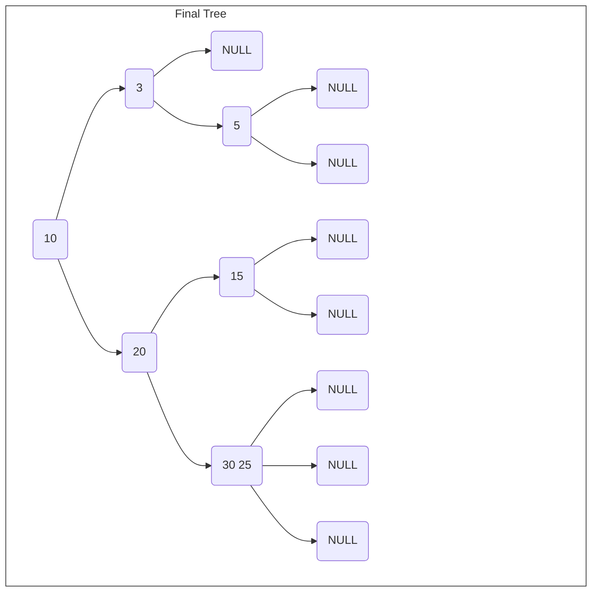

# Estrutura de Dados e Algoritmos 2

Este repositório é dedicado a disciplina de 'Estrutura de dados e algoritmos 2' da Universidade de Brasília. Tem como objetivo documentar as [Listas de Exercícios](#listas-de-exercícios) disponiblizadas no [CD-MOJ](https://moj.naquadah.com.br/cgi-bin/index.sh). Bem como a [Apostila](#apostila) dos conteúdos desenvolvidos durante o semestre. 

Professor: [Bruno Ribas.](https://www.brunoribas.com.br/)


# Listas de Exercícios

<b>Esta seção contém as listas de exercícios desenvolvidos na disciplina, para acessar os problemas basta clicar no link relacionado ao nome do exercíco em questão. E para acessar as soluções clique no título da lista desejada.</b>

## [Lista I - Desenferrujando para semestre](listas/lista1-Desenferrujando)  

<b>A primeira lista é voltada para revisão e familiarização com o formato das listas.</b>

- A : [Olá Mundo](https://moj.naquadah.com.br/contests/bcr-EDA2-2023_2-lista1-relembrando/olamundo.pdf)
- B : [Soma2](https://moj.naquadah.com.br/contests/bcr-EDA2-2023_2-lista1-relembrando/soma2.pdf)
- C : [SomaN](https://moj.naquadah.com.br/contests/bcr-EDA2-2023_2-lista1-relembrando/soma.pdf)
- D : [EOF](https://moj.naquadah.com.br/contests/bcr-EDA2-2023_2-lista1-relembrando/eof.pdf)
- E : [Viagem Aconselha](https://moj.naquadah.com.br/contests/bcr-EDA2-2023_2-lista1-relembrando/viagemaconselha.pdf)
- F : [Desfazer No Editor/cntrl z](https://moj.naquadah.com.br/contests/bcr-EDA2-2023_2-lista1-relembrando/ctrl-z.pdf)
- G : [Cofrinhos da vó Vitória](https://br.spoj.com/problems/COFRE.pdf)
- H : [Ultrapassa Minimamente](https://moj.naquadah.com.br/contests/bcr-EDA2-2023_2-lista1-relembrando/ultrapassaminimamente.pdf)
- I : [Soma String](https://moj.naquadah.com.br/contests/bcr-EDA2-2023_2-lista1-relembrando/soma_string.pdf)
- J : [Quem vai ser Reprovado](https://br.spoj.com/problems/PLACAR.pdf)
- K : [Frequẽncia na aula](https://br.spoj.com/problems/FREQUE12.pdf) 
- L : [Analisando dados de degustação](https://moj.naquadah.com.br/contests/bcr-EDA2-2023_2-lista1-relembrando/sequencia-desgustacao.pdf)
- M : [Número Proibido](https://moj.naquadah.com.br/contests/bcr-EDA2-2023_2-lista1-relembrando/proibido.pdf)
- N : [Notas da Turma](https://moj.naquadah.com.br/contests/bcr-EDA2-2023_2-lista1-relembrando/divide-turma.pdf)
- O : [Mescla Listas](https://moj.naquadah.com.br/contests/bcr-EDA2-2023_2-lista1-relembrando/le-junta.pdf)
---

## [Lista II - hashing](listas/lista2-hashing/)
<b>A segunda lista tinha o objetivo de resolver exercícios relacionados à [Hash Table](#1-hash-table).</b>

- A : [Desfile dos Patos](https://moj.naquadah.com.br/contests/bcr-EDA2-2023_2-hash/desfile.pdf)
- B : [Diga-me a frequência](https://moj.naquadah.com.br/contests/bcr-EDA2-2023_2-hash/digafrequencia.pdf)
- C : [Eleição U.R.S.A.L](https://moj.naquadah.com.br/contests/bcr-EDA2-2023_2-hash/eleicao-ursal-big.pdf)
- D : [Notas Curiosas](https://moj.naquadah.com.br/contests/bcr-EDA2-2023_2-hash/notas.pdf)
- E : [Notas](https://br.spoj.com/problems/NOTAS14.pdf)
- F : [HashIT!](https://www.spoj.com/problems/HASHIT.pdf)
- G : [Hash](https://br.spoj.com/problems/HASHADIQ.pdf)
- H : [Mensagens Nlogoniences](https://moj.naquadah.com.br/contests/bcr-EDA2-2023_2-hash/mensagens.pdf)
---

## [Listas III - Priority Queue](listas/lista3-priorityQueue/)
<b>A terceira lista contém exercícios de [Fila de Prioridades/Heap](#heap).</b>

- A : [Menores Placas](https://moj.naquadah.com.br/contests/bcr-EDA2-2023_2-pq/menores-placas.pdf)
- B : [Churrascarias da Avenida](https://br.spoj.com/problems/CHURRASC.pdf)
- C : [Minimun Stocks](https://www.spoj.com/problems/MINSTOCK.pdf)
---

## [Lista IV - QuickSelect](listas/lista4-quickSelect/)
<b>A quarta lista tem como enfoque o algoritmo [QuickSelect](#quickselect), um algoritmo de busca baseado no algoritmo de ordenação QuickSort.</b>

- A : [Classificados de Sementes](https://moj.naquadah.com.br/contests/bcr-EDA2-2023_2-quickselect/classificado-agronomia.pdf)
- B : [kk-página](https://moj.naquadah.com.br/contests/bcr-EDA2-2023_2-quickselect/kk-pagina.pdf)
- C : [Desfile dos Patos - QuickSelect](https://moj.naquadah.com.br/contests/bcr-EDA2-2023_2-quickselect/desfile.pdf)
- D : [Menores Placas - QuickSelect](https://moj.naquadah.com.br/contests/bcr-EDA2-2023_2-quickselect/menores-placas.pdf)

---

# Apostila

# 1. Hash Table
É uma estrutura do tipo chave-valor, onde as chaves são usadas como índice para achar o elemento desejado, não admite chaves repetidas (tabela de símbolos). A chave é passada por uma função (normalmente o módulo) onde é gerado o índice/endereço na tabela. Esta função tem caráter determinístico ou seja, uma mesma chave sempre gera um mesmo endereço. Dessa forma é possível acessar qualquer elemento da tabela em grandeza constante O(1).

- Função de hashing:
---
```C
int hash(int k, int m){
    return k % m;
}
```
---

## 1.1 Colisões

As colisões são um problema comum das tabelas hash, ocorrem quando duas chaves diferentes resultam no mesmo endereço. Existem várias técnicas para resolver colisões.

### 1.1.1 Endereçamento aberto
---
A estratégia do Endereçamento aberto, consiste basicamente em: se houver colisão, aloque o elemento 1 endereço pro lado. Porém, caso o número de colsões seja muito grande a busca passa a ser <b>linear (O(n))</b>, e não mais <b>constante (O(1))</b>.  

Por isso é interessante definir um número máximo de colisões para a hash, 10 por exemplo. Assim o tempo continuria sendo <b>constante (O(10))</b>. Mas, caso o limite de colisões esteja sendo muito excedido, há a chance de ter de crescer a tabela, que custa O(n).

### 1.1.2 Double Hash
---
A estratégia consiste em: quando ocorrer uma colisão, aplicar uma nova  função hash ao elemento desta forma, os elementos colididos ficariam mais espaçados entre si, diferente da estratégia anterior. Também é interessante manter um limite de colisões, para não preencher a tabela de forma rápida.

- Exemplo:
---
```C
#define HASH(K, M) (K % M)
#define DOUBLE_HASH(K, M) (K % 2M)
```
---
Onde 'K' é a chave e 'M' é o tamanho da hash table.

### 1.1.3 Encadeamento separado
---
Cada posição da hash table seria a cabeça de uma lista encadeada. Ou seja, sempre que ocorresse uma colisão, o elemento simplesmente seria adicionado ao início da lista encadeada. Diferente das outras, nessa estratégia é mais difícil que o número de colisões fique muito grande, já que elementos colididos não ocupam a posição de outros elementos, tal que, mesmo que em uma chave específica o acesso seja linear, em outros endereços ele continuria a ser constante. Logo, vale avaliar cada caso e verificar se um limite de colisões se torna necessário ou não.

## 1.2 Bônus - Discussão sobre complexidades

|                                  | Inserção | Remoção  | Busca    | Crescer  |
| -------------------------------- | -------- | -------- | -------- | -------- |
| **Vetor não ordenado**           | O(1)     | O(1)     | O(n)     | O(n)     |
| **Vetor Ordenado**               | O(n)     | O(n)     | O(log n) | O(n)     |
| **Lista encadeada não ordenada** | O(1)     | O(n)     | O(n)     | Dinâmico |
| **Lista encadeada ordenada**     | O(n)     | O(n)     | O(n)     | Dinâmico |
| **Hash Table**                   | O(1)     | O(1)     | O(1)     | O(n)     |
| **Árvores binárias**             | O(log n) | O(log n) | O(log n) | Dinâmico |

---
# 2. Árvore Red Black

Árvores Red Black são estruturas de árvores binárias de busca modificadas, para ficarem constantemente balanceadas, evitando o problema das árvores convencionais, que dependendo da ordem de inserção podem ficar com complexidade linear (O(n)) em vez de complexidade logarítmica (O(log n)), perdendo toda a razão de usar árvores e não outras estruturas. Cada nó da árvore tem uma cor, <b>vermelha ou preta</b>, e essas cores são usadas para aplicar as regras que garantem o balanceamento da árvore. Não admite chaves repetidas (tabela de símbolos).

## 2.1 Structs

```C
typedef struct Node{
    int data;
    struct Node *right;
    struct Node *left;
    bool red;
}Node;

typedef struct Tree{
    Node *root;
}Tree;
```
## 2.2 Regras da RedBlack

Os nós podem ser do tipo acima. Todo novo nó inserido é inserido com vermelho. E as seguintes regras têm de sempre ser seguidas:
<b>
1. Nenhum nó vermelho pode estar à direita do nó pai;
2. Não pode ter dois nós vermelhos à esquerda seguidos;
3. Um nó pai não pode ter os 2 filhos vermelhos.
 
</b>

---
- Assim que alguma das regras forem quebradas algum algoritmo deve ser chamado para resolver o problema: 
  1. Quando a regra <b>"1"</b> for quebrada deve ser aplicado um <b>rotateLeft()</b> para rotacionar o nó vermelho para à esquerda. 
  2. Quando a regra <b>"2"</b> for quebrada deve ser aplicado um <b>rotateRight()</b> para rotacionar o <b> elemento pai</b> para à direita, de forma que o elemento do meio se torne o novo pai.
  3. Quando a regra <b>"3"</b> for quebrada deve ser aplicado um <b>flipColors()</b> para trocar as cores dos nós filhos com o nó pai, pintando os nós filhos de <b>preto</b> e o nó pai de <b>vermelho</b>.

**Observação:**  A cor da raiz não importa .

---

### 2.2.1 Algoritmos de balanceamento

```C
    void flipColors(Node *root){
        h->left->red = !h->left->red;
        h->right->red = !h->right->red;
        h->red = !h->red;
    }

    Node *rotateLeft(Node *root)
    {
        Node *newroot = root->right;      //Novo no recebe a direita da raiz
        root->right = newroot->left;       //A direita da raiz recebe a arvore à esquerda da nova raiz
        newroot->left = root;            //A esquerda da nova raiz recebe a raiz antiga
        newroot->red = root->red;
        root->red = true;

        return newroot;
    }

    Node *rotateRight(Node *root)
    {
        Node *newroot = root->left;     //Novo no recebe a esquerda da raiz
        root->left = newroot->right;    //A esquerda da raiz recebe a arvore à direita da nova raiz
        newroot->right = root;          //A direita da nova raiz recebe a raiz antiga
        newroot->red = root->red;
        root->red = true;

        return newroot;
    }

```
### 2.2.2 Inserções em Árvore Red Black


- Exemplo de inserção em uma RedBlack com a seguinte sequência: 10, 15, 5, 3, 2, 20, 25, 30, 20.


- No exemplo é possível visualizar todos os os casos em que alguma das regras é quebrada, e como é o comportamento das respectivas funções de "correção" da árvore, além do formato final da árvore após todas as inserções.

### 2.2.3 Algoritmos de Inserção

```C
    bool isRed(Node *n)
    {
        if(n == NULL) 
            return false;
        if(n->red)
            return true;
        
        return false;    
    }

    Node *newnode(bool red, Node *left, Node *right, int data)
    {
        Node *nv = malloc(sizeof(Node));
        nv->red = red;
        nv->left = left
        nv->right = right;
        nv->data = data;

        return nv;
    }

    Node* insert(Node *root, int data)
    {
        if(root == NULL) 
            return newnode(true, NULL, NULL, data);

        //Inserção comum de uma BST
        if(less(data, root->data)){
            root->left = insert(root->left, data);
        }
        else if(less(root->data, data)){
            root->right = insert(root->right, data);
        }
        else{
            root->data = data
        }

        //Manipulações da Red Black
        //Regra 1
        if(!isRed(root->left) && isRed(root->right)) 
            root = rotateLeft(root);
        //Regra 2
        if(isRed(root->left) && isRed(root->left->left)) 
            root = rotateRight(root);
        //Regra 3
        if(isRed(root->left) && isRed(root->right))         
            flipColors(root)
    }
```

## 2.3 Alturas de uma Red Black
Em suma existem dois tipos de altura associadas à uma árvore red black, que são a **Altura total** e a **Altura Negra**.

### 2.3.1 Altura Total
A altura total refere-se à distância de qualquer nó folha até a raiz da árvore.

#### Funções:
```C
    int alturaTotal(Tree *root)
    {
        int count = 0;
        while(root != NULL)
        {
            count++;
            root = root->left;
        }
        return count;
    }
```
```C
    int alturaTotal(Tree *root, int h)
    {
        if(root == NULL)
            return h;

        int esq = alturaTotal(root->left, h + 1);
        int dir = alturaTotal(root->right, h + 1);

        if(esq > dir)
            return esq;

        return dir;
    }

```

### 2.3.2 Altura Negra
Altura Negra refere-se à distância de um nó folha **preto** até a raiz.

#### Função:
```C
    int alturaNegra(Tree *root, int h)
    {
        if (root == NULL) 
            return h;

        int esq = alturaNegra(root->left, h + 1);
        int dir = alturaNegra(root->right, h + 1);

        if(root->red == false && esq > dir)
            return esq; 
        else if(root->red == false && dir > esq)
            return dir;
    }
```

## 2.4 Bônus - Árvore 2-3
Árvores 2-3 são estruturas similares a as árvores red black. Também são constantemente balanceadas (altura = log n). Contém nós de 3 tipos, sendo um deles do tipo **"fantasma"**.

1. Tipo 2: dois filhos (contém apenas 1 elemento);
2. Tipo 3: três filhos (contém 2 elementos);
3. Tipo 4: quatro filhos (contém 3 elementos. **Temporário**, sempre que surge um nó deste tipo ele é quebrado e o elemento do meio se torna a nova raiz e agrupa os outros dois elementos a esquerda(menor) e a direita(maior)).

- A árvore final do [diagrama](#222-inserções-em-árvore-red-black), poderia ser representada da seguinte forma em um modelo de árvore 2-3:



# Fila de Prioridades
A Fila de Prioridades ou Heap, é uma estrutura que organiza os elementos com base em um valor que é definido como prioridade. Dispondo os elementos tal que, o de maior prioridade sempre estará no topo da fila. Ela é representada como uma árvore binária em vetor


# Grafos
Grafos são um conjunto de vértices e arestas.

## 4.1 Grafos dirigidos
São grafos nos quais as arestas possuem direção, ou seja, se tenho uma aresta de '0' para '1', não necessariamente tenho uma aresta de '1' para '0'.

## 4.2 Grafo Completo
Todos os vértices são ligados entre si, ou seja, todo vértice tem uma aresta para cada outro vértice no grafo. Totalizando no máximo (v-1)/2 arestas, onde 'v' é o número de vértices.

# QuickSelect

QuickSelect é um algoritmo de busca inspirado no QuickSort (ordenação). 