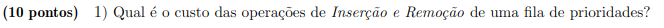
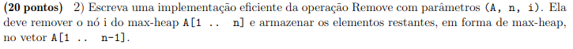
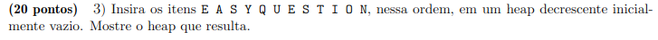
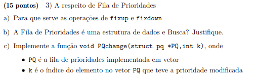

# PROVA 2 - Heap/Priority Queue, Grafos e Quickselect

### 1) 


Os custos de inserção em uma heap é logarítimica (O(log n)) e o custo de remoção é logarítimica (O(log n)). 

### 2)

 


###  3)



### 4)



a) A operação "fixup" em uma fila de prioridades serve para consertar para cima algum elemento que esteja abaixo de sua posição adequada, ou seja está abaixo de elementos que têm uma prioridade menor que a sua. A operação "fixdown" conserta para baixo a posição de um elemento que esteja acima de sua posição adequada, ou seja elementos com maior prioridade estão abaixo dele. 

b) Embora a fila de prioridades seja uma estrutura muito utilizada em algoritimos de busca com Dijkstra, A* e a BFS, ela não pode ser considerada uma estrutura de dados de busca.


c) 

``` C
    void PQchange(struct pq *PQ, int k, int newPriority)
    {
        if(k > 0 && k < PQ->size){
            PQ->array[k].priority = newPriority
            fixup(PQ, k);
            fixdown(PQ, k, PQ->size);
        }
    }
```