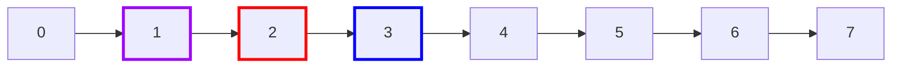
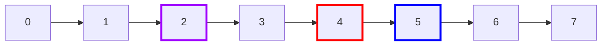
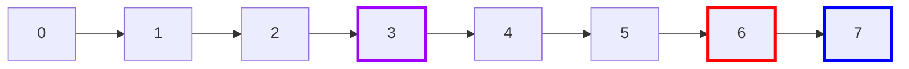
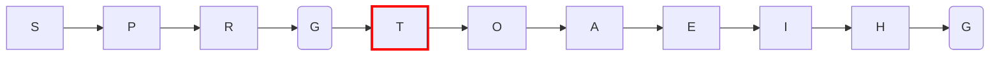
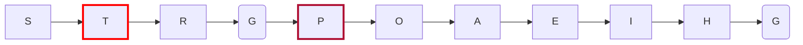
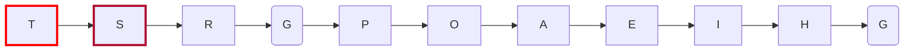
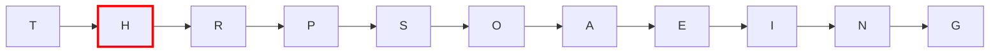
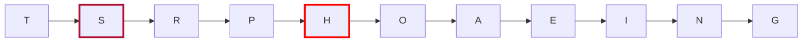
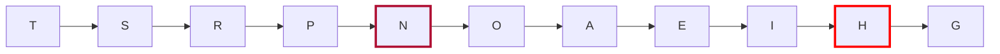

# 3. Fila de Prioridades

A Fila de Prioridades ou Heap, é uma estrutura que organiza os elementos com base em um valor que é definido como prioridade. Dispondo os elementos tal que, o de maior prioridade sempre estará no topo da fila, admite chaves reptidas, ou seja, com a **mesma prioridade**. Ela é representada como uma árvore binária em vetor, no qual **o índice zero fica inutilizado**, e os **filhos de um elemento k**, são, respectivamente, **2k e 2k + 1**, Reciprocamente o pai de qualquer elemento **k** é **k/2**.

- Exemplo:

>Legenda: Roxo: Pai (k), Vermelho: filho (2k), Azul: filho (2k + 1).







E assim sucessivamente.

## 3.1 Conceitos

### 3.1.1 Fila de prioridades crescente e decrescente (Min Heap e Max Heap)

Na **heap crescente** o elemento de **menor prioridade** está no topo da fila, conforme se move para baixo a prioridade dos elementos aumentam. Na **heap decrescente** o elemento de **maior prioridade** está no topo da fila, conforme se move para baixo a prioridade dos elementos diminuem.

### 3.1.2 Item máximo e item mínimo

Um item **K** é máximo se nenhum item é estritamente **maior** que **K**. Um item **K** é mínimo se nenhum item é estritamente **menor** que **K**. Podem existir mais de um item máximo e mais de um item mínimo.

### 3.1.3 Complexidades

|                    | Inserção | Remoção  | Consulta |
| ------------------ | -------- | -------- | -------- |
| **Priority Queue** | O(log n) | O(log n) | O(1)     |


## 3.2 Algoritmos

### 3.2.1 Struct e macros

```C
    #define less(a,b) (a < b)
    #define greater(a,b) (a > b)
    #define swap(a,b)   \
        {               \
            Item temp = a; \
            a = b;      \
            b = temp;   \
        }

    typedef struct Heap
    {
        Item *data;
        int size;
    }Heap;
```
>Obs: "Item" pode ser de qualquer tipo: int, char, tipos abstratos, etc... 

### 3.2.2 Conserta para cima (swim)

Suponha que em algum momento estejamos com a seguinte Heap crescente "estragada":

> Obs: quanto mais próximo do fim do alfabeto, maior a prioridade



- Observe que " T " está em uma posição errada, já que é o elemento de maior prioridade, então temos que consertar sua posição.




- O " T " assume a posição de " P ".



- E, por fim, o " T " assume sua posição correta. O algoritmo que foi aplicado para resolver a incongruência, pode ser chamado de **"Conserta para cima"** ou **"swim"**.

Função "Conserta para cima" ou **fixup**:

```C
    void fixup(Item *hp, int k)
    {
        //less() ou greater() depende da implementação
        for(int i = k; i > 1 && less(hp[i/2], hp[i]); i/=2) 
            swap(hp[i], hp[i/2]);
    }

    void fixup2(Item *hp, int k)
    {
        //less() ou greater() depende da implementação
        while(k > 1 && less(v[k/2], v[k]))
        {
            swap(v[k], v[k/2]);
            k /= 2;
        }
    }
```

### 3.2.3 Conserta para baixo (sink)

Suponha que em algum momento estejamos com a seguinte Heap decrescente "estragada":

> Obs: quanto mais próximo do fim do alfabeto, maior a prioridade



- Observe que " H " está em uma posição errada, está em uma posição acima de " P " e " S ", mesmo tendo menor prioridade.



- " H " troca com " S " ("S" já está na posição correta pois tem maior prioridade que qualquer elemento abaixo dele).



- " H " troca com " N " ("N" já está na posição correta pois tem maior prioridade que qualquer elemento abaixo dele).

Função "Conserta para baixo" ou **fixdown**:
```C
    void fixdown(Item *hp, int k, int size)
    {
        int j;
        while(2*k <= size)
        {
            j = 2*k;                            //j = filho 2k
            if(j < size && less(v[j + 1], v[j]))  //verfica qual filho é menor
                j++;                            //muda para filho (2k + 1), se for menor
            if(!less(v[k], v[j]))               //se o filho(j) tem menor prioridade que o pai(k), quebra o laço
                break;
            swap(v[k], v[j]);                   // troca pai e filho
            k = j;                              //pai assume posição do filho
        }
    }
```


### 3.2.4 Inserção, remoção e consulta

```C
    Heap PQinit(int n)
    {
        Heap hp;
        hp.size = 0;
        hp.data = malloc(sizeof(Item) * (k + 1));
        
        return hp;
    }

    void PQinsert(Heap *hp, Item c)
    {
        hp->data[++hp->size] = c;
        fixup(hp->heap, hp->size);
    }

    Item PQespia(Heap hp)
    {
        return hp.data[1];
    }

    Item PQremove(Heap *hp, int i)
    {
        Item t = hp->data[i];
        hp->data[i] = hp->data[hp->size--];
        fixdown(hp->data, hp->size, i);

        return t;
    }
    
    void PQchange(Heap *hp, int k, int newPriority)
    {
        if(k > 0 && k < hp->size){
            hp->array[k].priority = newPriority
            fixup(hp, k);
            fixdown(hp, k, PQ->size);
        }
    }
```
