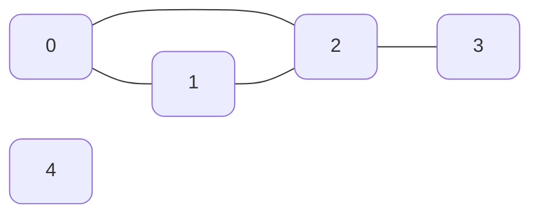
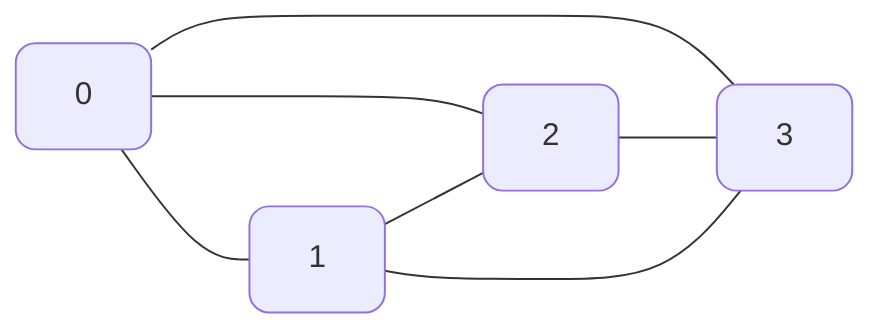
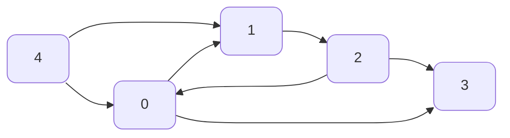
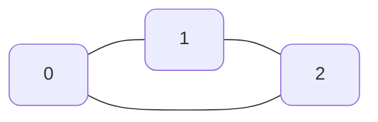
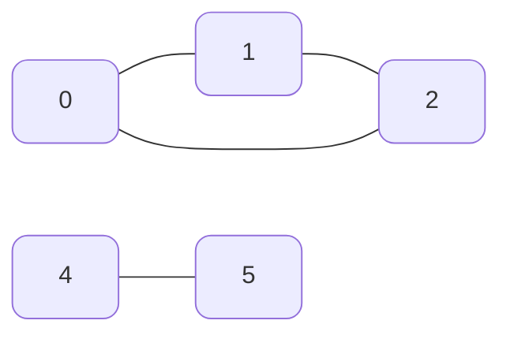
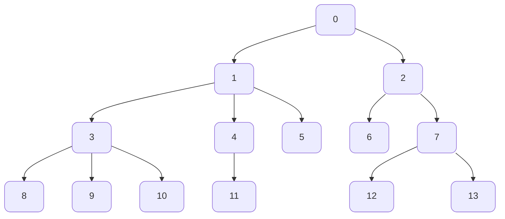
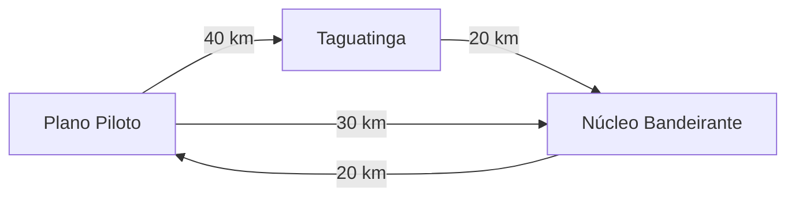

# 4. Grafos

Grafos são estruturas de dados amplamente utilizadas na computação. São uma ótima maneira de representar relacionamentos entre elementos, como por exemplo: mapas, redes, encanação, aeroportos, etc. Podem ser representados graficamente como um conjunto de vértices e arestas.

## 4.1 Implementação

Existem duas principais formas de reprensentá-los. **Matriz de adjacência** ou **Lista de adjacência**.

### 4.1.1 Matriz de Adjacência

Uma matriz bidimensional que representa a relação entre os vértices. Os elementos da matriz indicam se há ou não uma relação entre os vértices. Útil para grafos densos (completos ou quase completos). Consome espaço proporcional à V² (onde V é o número de vértices). Acesso rápido para verificar a existência de arestas (O(1)).

- Imagine o seguinte grafo:

<div align="center">
	


</div>

- Sua respectiva matriz de adjacência poderia ser representada da seguinte maneira:

|       | 0   | 1   | 2   | 3   | 4   |
| ----- | --- | --- | --- | --- | --- |
| **0** | 1   | 1   | 1   | 0   | 0   |
| **1** | 1   | 1   | 1   | 0   | 0   |
| **2** | 1   | 1   | 1   | 1   | 0   |
| **3** | 0   | 0   | 1   | 1   | 0   |
| **4** | 0   | 0   | 0   | 0   | 1   |

- **Os ' 1 's representam as conexões** e os **' 0 's a ausência delas**, por padrão a diagonal principal já é preenchida com ' 1 ', a conexão de um elemento com ele mesmo é trivial.

Veja a [Implementação.](#45-structs-e-algoritmos-inicias)

### 4.1.2 Lista de Adjacência

A ideia da lista de adjacência é construir um vetor de tamanho V (número de vértices) onde cada índice representa um vértice do grafo, e cada espaço do vetor contém um ponteiro para uma lista encadeada, que representa as conexões daquele vértice com outros vértices do grafo. Pode ser comparada ao [Encadeamento Separado](HashTable.md#113-encadeamento-separado) da Hash Table.

| 0   | 1   | 2   | 3   | 4   |
| --- | --- | --- | --- | --- |
| 1   | 2   | 3   |
| 2   |


Note que é uma representação bem mais enxuta comparada à matriz, logo também ocupa menos espaço. Vale ressaltar que, uma conexão não precisa ser representada duas vezes, ou seja, se um vértice tem conexão com um vértice menor que ele mesmo, não é necessário incluir esta aresta na lista de adjacências, pois esta aresta já estará representada no vértice menor, por exemplo a **aresta (0, 2)**, note que o **0** já contém a conexão com o **2**, portanto não se faz necessário representar esta conexão novamente no vértice **2**. Obviamente isto só é verdadeiro para [grafos não direcionados](#42-grafos-dirigidos-ou-digrafos), neste caso, aí sim, eu teria que inserir esta conexão em ambos vértices.

Veja a [Implementação.](#45-structs-e-algoritmos-inicias)

### 4.1.3 Bônus - Matriz X Lista

Apresentadas ambas estratégias, podemos definir algumas vantagens e desvantagens entre elas:
%3E E = número de arestas , V = número de vértices

|                        | Vetor de Arestas | Matriz de Adjacência | Lista de Adjacência |
| ---------------------- | ---------------- | -------------------- | ------------------- |
| **space**              | E                | V²                   | V + E               |
| **initialize**         | 1                | V²                   | V                   |
| **copy**               | E                | V²                   | E                   |
| **destroy**            | 1                | V                    | E                   |
| **insert Edge**        | 1                | 1                    | 1                   |
| **find/remove Edge**   | E                | 1                    | V                   |
| **Vertex is isolate?** | E                | V                    | 1                   |
| **Path from U to V**   | E * log V        | V²                   | E + V               |

## 4.2 Grafo Completo

Todos os vértices são ligados entre si, ou seja, todo vértice tem uma aresta para cada outro vértice no grafo. Totalizando o de máximo v*(v-1)/2 arestas, onde 'v' é o número de vértices.

<div align="center">



</div>

- Note que todos os vértices tem ligação entre si, tornando o grafo acima completo. Com um **total de 4 vértices**, têm-se um **total de 4*3/2** arestas, ou **6 arestas**.

## 4.3 Grafos dirigidos ou Digrafos

São grafos nos quais as arestas possuem direção, ou seja, se tenho uma aresta de '0' para '1', não necessariamente tenho uma aresta de '1' para '0'.

<div align="center">
	

</div>

- Há um fluxo entre os vértices, a partir do "0" consigo alcançar qualquer vértice, porém a partir do "3" não consigo atingir nenhum outro vértice.


## 4.4 Conceitos

### 4.4.1 Classificação de Vértices

- Vértices **"sink"** são aquelas que não possuem arestas **saindo** dele, apenas **chegando**, **3** é um vértice sink.
- Vértices **"source"** são aqueles que não possuem arestas **chegando** n'ele, apenas **saindo**, **4** é um vértice source.

### 4.4.2 Caminho 

Caminho em grafos é a **sequência de vértices** em que cada vértice **sucessivo** é **adjacente** ao predecessor, ou seja, cada vértice está conectado ao seguinte por uma aresta. São uma parte essencial da análise e resolução de problemas com grafos e podem ter diversas aplicações, incluindo navegação, otimização, planejamento de rotas, etc.

- **Caminho Simples** - Um caminho onde todos os vértices são distintos, exceto o primeiro e último, que podem ser iguais. *Obs: Não necessariamente o caminho mais curto*.

- **Caminho fechado (Circuito)** - Um caminho no qual o vértice de partida e vértice de chegada é o mesmo. Se for um **caminho simples**, todos os vértices no caminho são distintos, é chamado de **Ciclo**.

Exemplo:

<div align="center">


</div>

- **Caminho mínimo** -   O caminho mínimo entre dois vértices é o caminho mais curto em termos de custo, peso ou distância. Isso é frequentemente usado em problemas de otimização, como encontrar a rota mais curta em um sistema de transporte.

### 4.4.3 Conectividade

- **Grafo Conexo** - Um grafo é conexo se há um caminho de cada vértice para todo outro vértice. Em outras palavras não importa o vértice de partida você sempre será capaz de alcançar qualquer outro vértice do grafo. 

Exemplo:

<div align="center">


</div>
- **Grafo não Conexo** - Um grafo que não é conexo consiste em um conjunto de outros componentes conexos.

Exemplo:

<div align="center">
	


</div>

### 4.4.4 Grafos dirigidos conexos acíclicos

- É um grafo dirigido que não possui ciclos. **Árvores são grafos dirigidos acíclicos**, observe que **Toda árvore é um digrafo acíclico**, porém **nem todo digrafo acíclico é uma árvore**, vértices de um digrafo podem ter mais de uma aresta e não necessariamente existe uma hierarquia entre os filhos e o pai, diferentemente de uma árvore.

<div align="center">


</div>

### 4.4.5 Grafo dirigido fortemente conexo

A noção de **conectividade forte** é aplicada aos **digrafos**. Um grafo direcionado ou dirigido é considerado fortemente conexo se para cada par de vértices (v, w) existe uma aresta de **v para w** e uma aresta de **w para v**.

### 4.4.6 Fecho Transitivo

O **Fecho Transitivo** de um grafo dirigido é um grafo dirigido com o mesmo conjunto de vértices mas com uma aresta de **s** para **t**, se e somente se, existe um caminho dirigido de **s** à **t** no grafo dirigido.


**Floyd Warshall**:

```C title="Floyd Warshall" linenums="1"
	void graphtc(Graph *g){
		int i, s, t;
		//Inicia uma matriz de adj
		g->tc = MATRIXinit(g->v, g->v, 0);
		for(s = 0; s %3C g->v; s
			for(t = 0; t < g->v; t++)
				g->tc[s][t] = g->adj[s][t];
				
		//seta a diagonal principal
		for(s = 0; s < g->v; s++)
			g->tc[s][s] = 1;

		//Percorre as linhas i e as colunas s
		for(i = 0; i < g->v; i++)
			for(s = 0; s < g->v; s++)
				//Verifica se existe um caminho de s para i
				if(g->tc[s][i] == i)
					//Percorre todos os elementos da linha i
					for(t = 0; t < g->v; t++)
						//Verifica se há caminho entre i e t
						if(g->tc[i][t] == 1)
							//Se sim então também existe caminho de s para t
							//Cria uma nova aresta
							g->tc[s][t] = 1;
	}
```
### 4.4.7 Grafos Ponderados (Peso nas arestas)
O peso nas arestas pode ser, por exemplo, a distância física entre dois pontos.



Como implementar peso nas arestas?

- Matriz de adjacências:

|     | 1     | 2     | 3   |
| --- | ----- | ----- | --- |
| 1   | 0     | 40    | 30  |
| 2   | **∞** | 0     | 20  |
| 3   | 20    | **∞** | 0   |


## 4.5 Structs e algoritmos iniciais

A estrutura básica para representar um grafo é a **Aresta(Edge)**, que simboliza a conexão entre dois **Vértices(Vertex)**, que podem ser abstraídos para um **Item** em questão, que pode ser um `int`, `char` ou qualquer `tipo abstrato` que for definido.

```C 
    typedef struct Edge{
        int v; 
        int w;
    }Edge;  
```

Outras estruturas fundamentais são as de [Matriz de Adjacência](#411-matriz-de-adjacência) e [Lista de Adjacência](#412-lista-de-adjacência), que são:

```C 
    #define MAX_VERTEX 100 

    //Matriz de Adjacência
    typedef struct Graph{
        int numVertex;                      //Guarda o número total de vértices
        int size;                           //Número total de arestas
        int adj[MAX_VERTEX][MAX_VERTEX];    //Matriz de fato
    }Graph;

    //Lista de Adjacência
    typedef struct Node{
        int vertex;                         //Número do vértice atual
        Node *next;                         //Endereço do próx nó
        Edge *edges;                        //Lista/Vetor de conexões
    }Node;

    typedef struct Graph{
        int numVertex;                      //Guarda o número total de vértices
        int size;                           //Número total de arestas
        Node *adj;                          //Cabeça da lista
    }Graph;
```

## 4.6 Busca em Largura (BFS)

Se assemelha à uma explosão, feita para achar **menores caminhos**. A **BFS** explora todos os vizinhos de um nó antes de avançar para os vizinhos dos vizinhos. O algoritmo usa de uma **Fila** para controlar as ordens de acesso aos vértices. Ela garante que todos os vértices de uma profundidade *d* serão explorados antes de explorar vértices de uma profundidade *d + 1*.

```C
    bool visited[MAX_VERTEX];

    void bfs(Graph *G, Edge e)
    {
        int v, w;
        QueuePut(e);
        visited[e.w] = true;

        while(!QueueEmpty()){
            e = QueueGet();
            w = e.w;
            for(int *l = G->adj[w]; l != NULL; l = l->next){
                int t = l->vertex;
                if(visited[t] == false){
                    QueuePut(Edge{w, t});
                    visited[t] = true;
                }

            }
        }
    }
```

## 4.7 Busca em profundidade (DFS)

Explora sempre o caminho mais profundo do grafo antes de retroceder. Faz uso de uma **Pilha** ou de **Recursão**(que também é um pilha) para controlar a ordem de acesso aos vértices. Algoritmo guloso, vai em um mesmo caminho até não conseguir mais, boa para **BackTracking** (fazer uma escolha baseado no que acontecer), usada para encontrar soluções, como caminhos mais longos ou todos os caminhos possíveis. Melhor quando é preciso encontrar todos os caminhos de um grafo.

- Implementação 1 (Bruno Ribas):

```C
    bool visited[MAX_VERTEX] = {false};

    void dfsr(Graph *G, Edge e)
    {
        int t, w = e.w;
        visited[w] = true;

        for(t = 0; t < G->numVertex; t++)
            if(G -> adj[w][t] != 0)
                if(visited[t] == false)
                    dfsr(G, Edge{w, t});
    }
```

- Implementação 2:

```C
    void dfsUtil(Graph *G, int vertex, bool visited)
    {
        visited[vertex] = true;

        Node *temp = G->adj[vertex];

        while(temp != NULL)
        {
            int adjVertex = temp->vertex;
            if(!visited[adjVertex])
                dfsr2(G, adjVertex, visited);
            temp = temp->next;
        }
    }

    void dfs(Graph *G, int startVertex)
    {
        bool visited[MAX_VERTEX];
        for(int i = 0; i < MAX_VERTEX; i++)
            visited[i] = false;
        dfsUtil(G, startVertex, visited);
    }
```

## 4.8 Problemas clássicos e Algoritmos Fundamentais

### 4.8.1 Problema do Menor caminho

Imagine um grafo dirigido ponderado, o ***caminho*** de um vértice *v* até um vértice *w* é o conjunto de arestas que ligam *v* e *w*. O ***peso*** de um caminho *C* será a soma dos pesos da arestas que o compõe. *C* será mínimo, se e somente se, nenhum outro caminho com a mesma *origem* e mesmo *destino* tiver um *peso* menor que o peso de *C*. A ***distância*** de um vértice *v* a *w* é o ***caminho mínimo*** de *v* a *w*. Se não existe nenhum caminho de *v* para *w*, então a ***distância*** de *v* para *w* é **infinita**. É claro que, em geral, a distância de v para w é diferente da distância de w para v.

> **Como encontrar a distância de uma origem para qualquer outro vértice de um grafo dirigifo ponderado *G*?**

O problema faz sentido, para pesos **positivos e negativos**, porém vamos focar nos positivos primeiro.

#### 4.8.1.1 Dijkstra    

O algoritmo de Dijkstra é um algoritmo clássico de **caminho mínimo**, para encontrar o caminho mais curto de um nó de origem para todos os outros nós de um **grafo ponderado** com arestas de **peso não negativo**. 

```C
void Dijkstra(Graph *g, int start)
{
    for (int i = 0; i < g->numVertex; i++)
        pa[i] = -1, dist[i] = INFINITY, visited[i] = false;

    pa[start] = start, dist[start] = 0;

    Heap h = PQInit(g->numVertex);

    for(int i = 0; i < g->numVertex; i++)
        PQInsert(h, i, dist[i]);

    while(!PQEmpty(h))
    {
        int y = PQPop(h);
        if(dist[y] == INFINITY) break;

        for(Edge e = g->edges[y]; e != NULL; e = e.next)
        {
            if (visited[e.w]) continue;
            if (dist[y] + e.weight < dist[e.w])
            {
                dist[e.w] = dist[y] + e.weight;
                PQChange(h, e.w, dist[e.w]);
                pa[e.w] = y;
            }
            visited[y] = true;
        }
    } 
    PQFree(h);
}
```

**Complexidade:** O(E log V) 

#### 4.8.1.2 Bellman Ford

Assim como o Algoritmo de Dijkstra, o Alogritmo de Bellam Ford, surge para solucionar o problema de menor caminho em um grafo ponderado, porém, diferente do Dijkstra, este algoritmo não se limita apenas a grafos ponderados de arestas não negativas, ele também funciona para arestas de **pesos negativos**.

```C
bool BellmanFord(Graph g, vertex s, vertex *pa, int *dist)
{
   PQInit(g->numEdges);
   bool visited[1000];
   for (vertex u = 0; u < g->numVertex; ++u)
      pa[u] = -1, dist[u] = INFINITY, visited[u] = false;
   pa[s] = s, dist[s] = 0;

   PQInsert( s);
   visited[s] = true;
   vertex V = g->V; 
   PQInsert(V); 
   int k = 0;

   while (true) { 
      vertex v = PQPop( );
      if (v < V) {
         for (link a = g->adj[v]; a != NULL; a = a->next) {
            if (dist[v] + a->c < dist[a->w]) {
               dist[a->w] = dist[v] + a->c; 
               pa[a->w] = v;
               if (visited[a->w] == false) {
                  PQInsert( a->w);
                  visited[a->w] = true;
               }
            }
         }
      } else {
         if (PQEmpty()) return true; 
         if (++k >= g->V) return false;
         PQInsert(V); 
         for (vertex u = 0; u < g->V; ++u) 
            visited[u] = false;
      }
   }
}
```

### 4.8.2 Problema das árvores geradoras e árvores geradoras de custo mínimo (MST)

A árvore de um grafo G, é um subgrafo conexo sem ciclos. Uma **árvore** é ***geradora***, se abrange todos os vértices do grafo original G. Como as árvores são conexas todo grafo não-dirigido que possui uma árvore geradora é conexo. E todo grafo conexo não-dirigido é dotado de ao menos uma **árvore geradora**. Toda árvore geradora de uma grafo não-dirigido com ***V*** vértices, tem exatamente ***V - 1*** arestas.

Agora, uma **árvore geradora *T*** é ***mínima***, se nenhuma outra árvore geradora de *G* tem **custo menor que *T***, sendo o *custo* de ***T***, a soma dos custos/pesos de suas arestas.  Árvores geradoras mínimas, também chamadas de MSTs (*minimum spanning tree*), existem, se e somente se, o grafo G é conexo.

**Como encontrar a MST de um grafo *G*?**   

#### 4.8.2.1 Prim

O algoritmo de Prim, é um algoritmo para o problema de encontrar uma MST de um *grafo ponderado não-dirigido*. Os custos das arestas são números arbitrários (positivos e negativos) e só é possível encontrar a MST se o grafo é conexo. 

Dado um grafo G, ponderado, não-dirigido e conexo, O algoritmo cultiva uma árvore até que se torne geradora e, ao final, ela será uma MST.  

O processo se dá apartir de uma árvore inicial *T*  que na primeira iteração será um único vértice(**semente**), que é escolhido arbitrariamente. 

Para prosseguir será necessário definir os conceitos de **franja, fronteira, preço e gancho**.
- A **franja** de uma subárvore *T* é o conjunto de todas as arestas que ligam um vértice de *T* à algum outro vértice que está fora de *T*. 
- A **fronteira** de *T* é o conjunto de vértices que não estão em *T*, porém são vizinhos aos vértices de *T*.
- O **preço** de de um vértice *v* é o **custo mínimo** de uma aresta que incide em *v*
- O **gancho** de um vértice *v*, é um vértice *w* que determina o **preço**(custo mínimo) de v, ou seja é o vertíce *w* de menor custo que se liga à um vértice *v*. 

Portanto, para uma subárvore *T* de um grafo não-dirigido conexo ponderado G, o algoritmo segue da seguinte forma:

**Enquanto** a franja de *T* não estiver vazia:
1. Escolha um vértice *y* na **fronteira** de *T*;
2. Seja *x* o gancho de *y*;
3. Acrescente a aresta (x, y) e o vértice *y* a *T*;
4. Atualize os preços e os ganchos fora de T.

Para armazenar os ***preços*** podemos usar um vetor `preco[]` indexado pelos vértices, e para armazenar os ***pais*** e os ***ganchos*** podemos usar um vetor `pa[]`, onde, se *v* está em *T*, então `pa[v]` é o pai de *v*, se *v* está na fronteira de *T* então `pa[v]` é um gancho de *v*, ou seja se *v* está na **fronteira** de *T* `pa[v]` é um "pai provisório" de *v*, que pode ser alterado conforme o algoritmo progride. 

O *Prim* é um algoritmo *guloso* (greedy), portanto ele sempre vai consumir a aresta de ***menor custo*** da ***franja***.

A partir disso, podemos construir duas implementações eficientes do Algoritmo de Prim, uma primeira, eficiente para **grafos densos** que utiliza apenas os vetores como forma de controle, além de uma segunda mais eficiente para **grafos esparsos**, que utiliza de uma **Fila de Prioridades(Heap)** para armazenar os vértices fora *T* priorizados pelo *preço*.

> Obs: Assuma que os vetores já estão implementados de maneria global e que `dist[]` equivale a `preco[]`.

- Implementação 1:

```C
void Prim(Graph *g, int start)
{
	//Inicialização
	for (int i = 0; i < g->numVertex; ++v)
		pa[i] = -1, visited[i] = false, dist[i] = INFINITY;
	
	//Seta o próprio elemento como visitado e como pai
	pa[start] = start, visited[start] = true;
	
	for (Edge *e = g->edges[0]; e != NULL; e = e->next)
	{
		pa[e->w] = 0;
		dist[e->w] = e->weight;
	}
	
	for(;;) 
	{
		int min = INFINITY;
		int y;
		
		for(int w = 0; w < g->numVertex; ++w)
		{
			if(!visited[w] && dist[w] < min)
				min = dist[w], y = w;
		}
		if(min == INFINITY)
			break;
		visited[y] = true;
		for(Edge *e = g->edges[y]; e != NULL; e = e->next)
		{
			if(!visited[e->w] && e->weight < dist[e->w])
			{
				dist[e->w] = e->weight;
				pa[e->w] = y;
			}
		}
	}
}
```

**Complexidade**: O(V²) como o tamanho de grafos **densos** é proporcional a V² podemos dizer que a *Implementação 1* é **linear** para grafos **densos**.


- Implementação 2:

```C
void Prim(Graph *g, int start)
{
		for (int i = 0; i < g->numVertex; ++i)
		pa[i] = -1, visited[i] = false, dist[i] = INFINITY;
	
	pa[start] = start, visited[start] = true;
	
	for (Edge *e = g->edges[0]; e != NULL; e = e->next)
		pa[e->w] = 0, dist[e->w] = e->weight;
		
	Heap *h = PQInit(g->numVertex);
	for(int v = 1; v < g->numVertex; ++v)
		PQInsert(v, dist);
	
	while(!PQEmpty(h))
		{
		int y = PQPop(dist);
		if(dist[y] == INFINITY)
			break;
		visited[y] = true;
		
		for(Edge *e = g->edges[y]; e != NULL; e = e->next)
			if(!visited[e->w] && e->weight < dist[e->w])
			{
				dist[e->w] = e->weight;
				PQChange(h, e->w, dist[e->w]);
				pa[e->w] = y
			}
	}
	PQFree(h);
}
```

A *implementação 2* utiliza uma [[README#^c7fb0b|Fila de Prioridades]] para armazenar os elementos de **menor custo**.

**Complexidade**: O(E log V), apenas um pouco pior que a linear, podemos chamar de ***linearítmica***.


> Implementação 1 X Implementação 2

Como dito anteriormente, se nos restringirmos a **grafos esparsos**, a *Imp2* é mais rápida que a *Imp1*, porém em **grafos densos**, a situação se inverte.

#### 4.8.2.2 Kruskal

O **algoritmo de Kruskal** é um algoritmo que busca solucionar o mesmo problema que o algoritmo de Prim, construir a MST de um grafo não-dirigido e ponderado. Porém, aqui vêm a primeira diferença. O Prim era aplicável somente para **grafos conexos**, porém se aplicarmos o **Kruskal** para um grafo com *k* componentes conexas, obteremos *k* *MSTs* distintas, uma para cada componente conexa do grafo.

O algoritmo de kruskal tem comportamento *guloso*(greedy), ele é baseado na lógica de **Ordenação de Arestas**. Cada iteração começa com uma **floresta geradora *F*** de um grafo *G* que é incialmente vazia. Enquanto não existirem arestas externas, o algoritmo adiciona uma aresta ***α***, de peso mínimo, a *F*, se e somente se, (1) ***α*** é uma aresta externa a ***F*** e (2) ***F + α*** continua sendo uma floresta, ou seja, a **adição de *α* a *F* não gera ciclos**. 

Ao final do procedimento a Floresta ***F*** será conexa desde que ***G*** seja conexo. Assim ***F*** será uma MST. 

O algoritmo tem um funcionamento bem simples, porém surge o seguinte problema: como saber se um vértice *v* já esta ligado a um vértice *w*? Afim de evitar ciclos. E assim, entra a **UFDS (Union-Find-Disjoint-Set)** Uma estrutura de dados otimizada que permite verificar e controlar a conectividade de componentes entre ***sets***(conjuntos). 

A partir disso, podemos implementar o **Algoritmo de Kruskal** da seguinte forma:

>Obs: Assuma que a estrutura **UFDS** e suas respectivas funções já estão implementadas.

```C
void Kruskal(Graph *g, Edge *edges, int numEdges)
{
	//Ordenação do vetor de arestas, pode ser um quick ou um merge
	mergesort(edges, 0, numEdges);
	
	Edge *choosenEdges = malloc(sizeof(Edge) * (g->numVertex - 1));
	int lenChoosenEdges = 0;
	
	UFDS *ufds = UFDSInit(g->numVertex);
	
	for(int i = 0; i < numEdges && lenChoosenEdges < g->numVertex; i++)
	{
		int v = edges[i].v;
		int w = edges[i].w;
		
		if(!UFDS_SameSet(ufds, v, w))
			choosenEdges[lenChoosenEdges++] = edges[i], Union(ufds, v, w);
	}
	UFDS_Destroy(ufds);
	return choosenEdges; //Floresta F
}
```

**Complexidade**: O(E log E).
